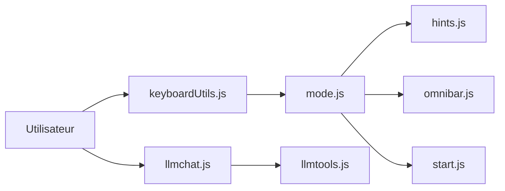

# brookhong/Surfingkeys

> Extension de navigateur pour naviguer au clavier à la Vim, configurable en JavaScript.

## Le problème
Naviguer au clavier sur le web est limité aux raccourcis du navigateur et chaque site impose les siens.

## Ce que ça fait vraiment
Modes normal, visuel, insertion, indices de liens (hints), omnibar, marques, sessions, éditeur Vim intégré, aperçu Markdown, visionneuse PDF, proxy. Tous les réglages sont du JavaScript (`api.mapkey`). Un chat LLM (touche `A`) parle à Ollama, Bedrock ou toute API compatible OpenAI avec tes identifiants ; chaque appel d'outil navigateur est confirmé par l'utilisateur.

## Comment c'est branché


## Essayer
```bash
# installer depuis le Chrome Web Store, Firefox Add-ons, Edge ou Mac App Store
# puis dans une page : ? pour l'aide, f pour suivre un lien, A pour le chat LLM
```

## Coût et pièges
Gratuit. Le chat LLM nécessite des identifiants dans `settings.llm`. Certaines fonctions manquent sur Firefox et Safari ; charger des réglages depuis un fichier local demande un native host.

## Ce que ce n'est pas
Pas un outil d'automatisation de navigateur ni un scraper. Chrome limite certaines touches, d'où un build Chromium dédié mentionné. 426 issues ouvertes.

## Alternatives
vimium et cVim : cités dans les crédits comme prédécesseurs.

## Pour toi
Surveiller : un confort de navigation pour lire de la doc et des papiers, sans enjeu data/IA ; le chat LLM est un bonus facultatif.

