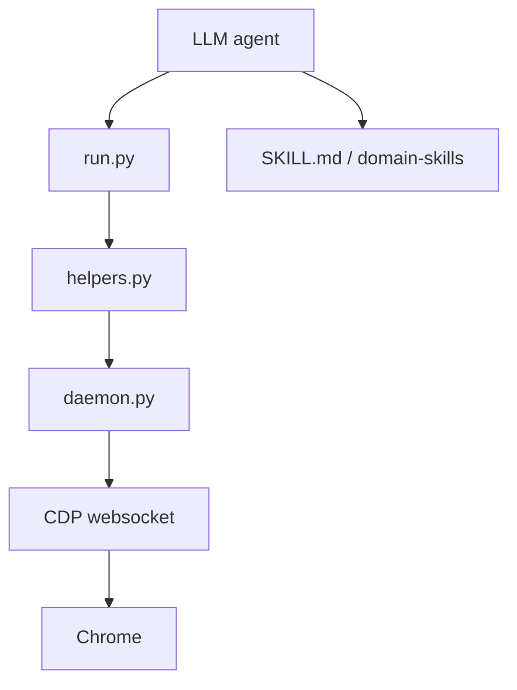

# browser-use/browser-harness

> Pont CDP minimal entre un agent LLM et ton vrai Chrome, que l'agent enrichit lui-même.

## Le problème
Les frameworks d'automatisation figent les actions possibles. Il leur manque souvent l'upload, les iframes ou une session déjà connectée.

## Ce que ça fait vraiment
Le code Python se connecte à Chrome par websocket CDP grâce à `admin.py` et `daemon.py`.
L'agent passe par `helpers.py`. Quand une action lui manque, il écrit lui-même le helper dans son espace de travail.
Les playbooks Markdown `interaction-skills/` et `domain-skills/` servent de mémoire.
Un serveur MCP, `browser-harness-mcp`, est fourni.

## Comment c'est branché

## Essayer
Le README ne donne aucune commande shell : l'installation passe par une consigne à coller dans Claude Code ou Codex (uv, Python 3.12), puis `chrome://inspect/#remote-debugging`.

## Coût et pièges
C'est gratuit en local. Pour passer à plusieurs navigateurs, il faut Browser Use Cloud, qui est payant. L'agent pilote ton navigateur connecté et a donc accès à tes sessions.

## Ce que ce n'est pas
Le README est très court, d'où une fiche partielle. Ce n'est pas un framework de test reproductible : les helpers changent d'une tâche à l'autre.

## Alternatives
Le README ne nomme aucun dépôt alternatif.

## Pour toi
À surveiller : l'idée d'un harness qui se modifie lui-même est intéressante pour les agents web, mais lui donner la main sur ton propre Chrome est un risque à peser.
