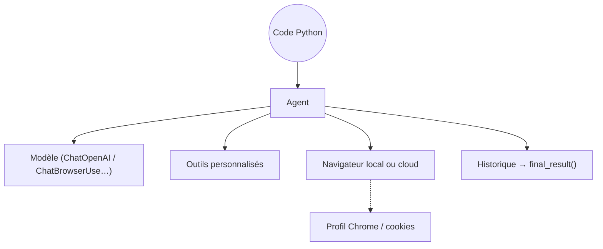

# browser-use/browser-use

> Bibliothèque Python qui donne à un LLM le contrôle d'un vrai navigateur, sous licence MIT.

## Le problème
Beaucoup de données ne sont accessibles qu'à travers une interface web, derrière un formulaire ou une session.
Écrire un script Playwright par site casse dès que la page change.

## Ce que ça fait vraiment
Un objet `Agent(task=..., llm=...)` pilote un navigateur local ou distant jusqu'à répondre à la tâche.
Le prompt système est fourni par la bibliothèque ; on peut l'étendre ou le remplacer.
Outils personnalisés enregistrables via `Tools()` et un décorateur `@tools.action`.
Trois modes d'usage : cloud entièrement hébergé, CLI branchée sur un agent existant, bibliothèque Python.

## Comment c'est branché


## Essayer
```bash
uv add browser-use
uv run agent.py
```
```python
from browser_use import Agent, ChatOpenAI
agent = Agent(task="Find the number of stars of the browser-use repo", llm=ChatOpenAI(model='gpt-5.6-luna'))
```

## Coût et pièges
Python ≥ 3.11. La bibliothèque est gratuite ; l'inférence et les navigateurs cloud sont facturés (~0,02 $/heure navigateur).
Le contournement de CAPTCHA et la furtivité passent par le service payant — aucune garantie de résultat.

## Ce que ce n'est pas
Pas un scraper : chaque action consomme des tokens, donc le coût croît avec le nombre de pages.
Pas déterministe — un agent LLM peut cliquer au mauvais endroit et produire une action irréversible.
La synchronisation de profil ne transfère que les cookies, ni localStorage ni extensions.

## Alternatives
- `D4Vinci/Scrapling` : moins cher et déterministe quand la structure de la page est stable.
- `unclecode/crawl4ai` : pour récupérer du contenu en Markdown sans piloter un agent.

## Pour toi
À réserver aux sites où aucun script ne tient ; sinon le coût par page devient déraisonnable.
