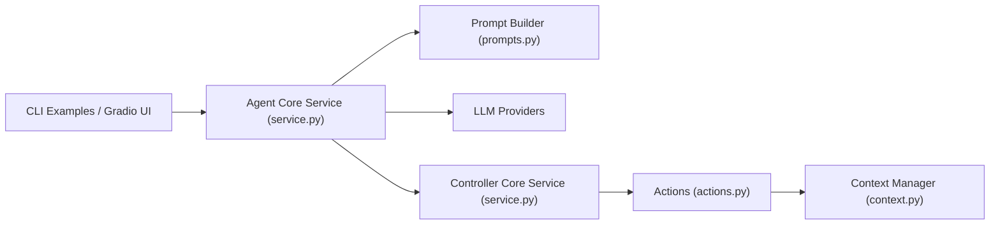

# browser-use/macOS-use

> Bibliothèque Python où un agent LLM pilote les applications d'un Mac, pour expérimentateurs.

## Le problème
Automatiser des tâches dans des applications macOS sans API, uniquement par l'interface graphique.

## Ce que ça fait vraiment
Un agent construit un prompt, interroge un LLM (OpenAI, Anthropic ou Gemini), puis un contrôleur retrouve l'action dans un registre et la déclenche via le module `mac` (actions, arbre d'éléments UI). Boucle jusqu'à l'appel de `done`. Exemples en CLI et petite interface Gradio ; module de télémétrie présent dans le code.

## Comment c'est branché


## Essayer
```bash
pip install mlx-use
git clone https://github.com/browser-use/macOS-use.git && cd macOS-use
cp .env.example .env
brew install uv && uv venv && source .venv/bin/activate
uv pip install --editable . && python examples/try.py
```

## Coût et pièges
Clé d'API OpenAI, Anthropic ou Gemini à ta charge ; macOS obligatoire. Le README avertit : l'agent peut utiliser tes identifiants et ne s'arrête pas aux CAPTCHA.

## Ce que ce n'est pas
Pas un outil supervisé ni sûr : « ne pas l'utiliser sans surveillance ». L'inférence locale MLX est une vision, pas une fonction livrée. Dernier push en mars 2025.

## Alternatives
Aucune alternative nommée dans le README.

## Pour toi
À ignorer : projet d'early stage sans mise à jour depuis plus d'un an, avec des risques réels sur les identifiants de la machine.
