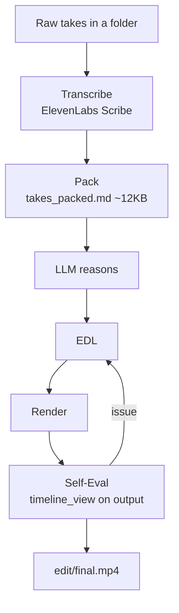

# browser-use/video-use

> **An agent skill that edits raw video footage by reading its transcript instead of its frames.**

## The problem

Editing raw footage means hunting down filler words, dead air and retakes by hand. Handing the job
to an LLM as images is expensive: the README puts the naive approach at 30,000 frames × 1,500
tokens, i.e. 45M tokens of noise.

## What it actually does

You drop raw takes in a folder, chat with the agent, and get `edit/final.mp4` next to the sources.
It cuts filler words (`umm`, `uh`, false starts) and dead space between takes, colour grades each
segment, applies 30ms audio fades at every cut, burns subtitles (2-word uppercase chunks by
default), and generates animation overlays through HyperFrames, Remotion, Manim or PIL in parallel
sub-agents. Session memory lives in `project.md`. A self-evaluation pass re-reads the rendered
output at every cut boundary before showing it to you.

## How it is wired

No code-derived diagram exists for this repository: the graph below restates the pipeline described
in the README. Two reading layers: an ElevenLabs Scribe transcript, always loaded, giving
word-level timestamps, speaker diarization and audio events, packed into a ~12KB `takes_packed.md`;
and `timeline_view`, called on demand, which renders a filmstrip + waveform + word-label PNG for a
given time range.



## Try it

The README gives a setup prompt to paste into any agent with shell access, plus a manual install:

```bash
git clone https://github.com/browser-use/video-use ~/Developer/video-use
ln -sfn ~/Developer/video-use ~/.claude/skills/video-use        # Claude Code
cd ~/Developer/video-use
uv sync                         # or: pip install -e .
brew install ffmpeg             # required
brew install yt-dlp             # optional, for downloading online sources
cp .env.example .env
$EDITOR .env                    # ELEVENLABS_API_KEY=...
```

Then, from the video folder: `claude`, and in session "edit these into a launch video".

## Cost and traps

Transcription goes through ElevenLabs Scribe: an API key is requested at install time and billed to
you, one call per source. `ffmpeg` is required, `yt-dlp` optional. The self-eval loop can re-render
up to three times, so extra machine time. The README's install commands use `brew`, so they assume
macOS.

## What it is not

Not a GUI video editor: everything runs through a command-line agent. The LLM never watches the
video, it reads it — cuts come from speech boundaries and silence gaps, not from the image, which
limits purely visual editing decisions. Not autonomous either: the README stresses
"ask → confirm → execute", the cut strategy needs your approval. And not offline, since
transcription is a third-party service.

## Alternatives

No comparable alternative in the catalogue: the suggested neighbours (`github/spec-kit`,
`pbakaus/impeccable`, `openinterpreter/open-interpreter`, `gastownhall/beads`) do not deal with
video editing. The README names HyperFrames, Remotion, Manim and PIL, but as animation generators
used *by* video-use, not as substitutes.

## For you

Mostly interesting as an architecture pattern: give the LLM a structured textual view rather than
pixels — the same move browser-use makes with the DOM, transposed to video. The agent-skill layout
(SKILL.md, helpers/, memory in project.md) also reads as a template for other pipelines. For direct
use, the ElevenLabs dependency and the macOS-oriented install are worth testing first.
