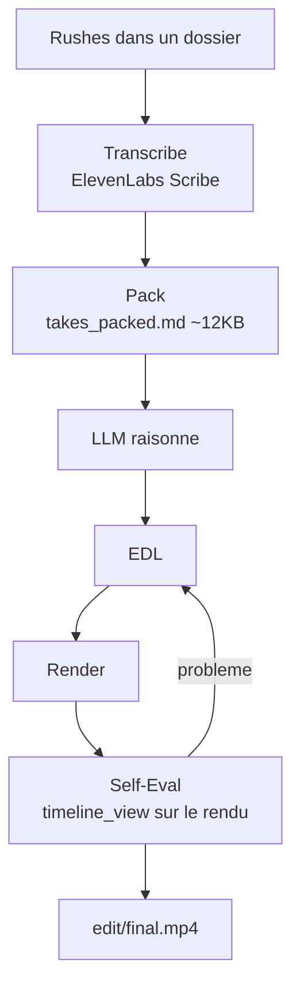

# browser-use/video-use

> **Un skill d'agent qui monte des rushes vidéo en lisant leur transcription plutôt que leurs images.**

## Le problème

Monter une vidéo depuis des rushes bruts demande de repérer les hésitations, les silences et les
reprises à la main. Confier la tâche à un LLM en lui envoyant les images coûte cher : le README
chiffre l'approche naïve à 30 000 images × 1 500 tokens, soit 45 M de tokens.

## Ce que ça fait vraiment

On dépose les rushes dans un dossier, on discute avec l'agent, on récupère `edit/final.mp4` à côté
des sources. L'outil coupe les mots de remplissage (`umm`, `uh`, faux départs) et les temps morts,
étalonne la couleur de chaque segment, applique des fondus audio de 30 ms à chaque coupe, incruste
des sous-titres (par défaut des blocs de 2 mots en majuscules), et génère des animations via
HyperFrames, Remotion, Manim ou PIL dans des sous-agents parallèles. La mémoire de session est
conservée dans `project.md`. Une auto-évaluation relit le rendu à chaque frontière de coupe avant
de le montrer.

## Comment c'est branché

Aucun diagramme tiré du code n'existe pour ce dépôt : ce schéma reprend le pipeline décrit dans le
README. Deux couches de lecture : la transcription audio ElevenLabs Scribe, toujours chargée, qui
donne des horodatages au mot, la diarisation et les événements sonores, empaquetés dans un
`takes_packed.md` d'environ 12 Ko ; et `timeline_view`, appelé à la demande, qui produit un PNG
filmstrip + forme d'onde + étiquettes de mots pour une plage de temps.



## Essayer

Le README fournit une invite de mise en place à coller dans un agent à accès shell, et une
installation manuelle :

```bash
git clone https://github.com/browser-use/video-use ~/Developer/video-use
ln -sfn ~/Developer/video-use ~/.claude/skills/video-use        # Claude Code
cd ~/Developer/video-use
uv sync                         # or: pip install -e .
brew install ffmpeg             # required
brew install yt-dlp             # optional, for downloading online sources
cp .env.example .env
$EDITOR .env                    # ELEVENLABS_API_KEY=...
```

Puis, dans le dossier de vidéos : `claude`, et en session « edit these into a launch video ».

## Coût et pièges

La transcription passe par ElevenLabs Scribe : une clé d'API est demandée à l'installation et
facturée à ta charge, un appel par source. `ffmpeg` est requis, `yt-dlp` optionnel. La boucle
d'auto-évaluation relance le rendu jusqu'à trois fois, donc du temps machine en plus. Les commandes
d'installation du README passent par `brew`, donc orientées macOS.

## Ce que ce n'est pas

Ce n'est pas un éditeur vidéo avec interface : tout passe par un agent en ligne de commande. Le LLM
ne regarde jamais la vidéo, il la lit — les décisions viennent des frontières de parole et des
silences, pas de l'image, ce qui limite un montage piloté par le contenu visuel. Ce n'est pas non
plus autonome : le README insiste sur « ask → confirm → execute », la stratégie de coupe doit être
approuvée. Et ce n'est pas indépendant du réseau, puisque la transcription est un service tiers.

## Alternatives

Aucune alternative comparable dans le catalogue : les voisins proposés (`github/spec-kit`,
`pbakaus/impeccable`, `openinterpreter/open-interpreter`, `gastownhall/beads`) ne touchent pas au
montage vidéo. Le README nomme HyperFrames, Remotion, Manim et PIL, mais comme générateurs
d'animations utilisés *par* video-use, non comme substituts.

## Pour toi

Intéressant surtout comme patron d'architecture : donner au LLM une vue textuelle structurée plutôt
que des pixels, exactement la transposition de ce que browser-use fait avec le DOM. Le format
« skill d'agent » — SKILL.md, helpers/, mémoire dans project.md — est aussi lisible comme modèle
pour d'autres pipelines. En usage direct, la dépendance ElevenLabs et le ciblage macOS méritent un
test avant d'en faire un outil de production.
