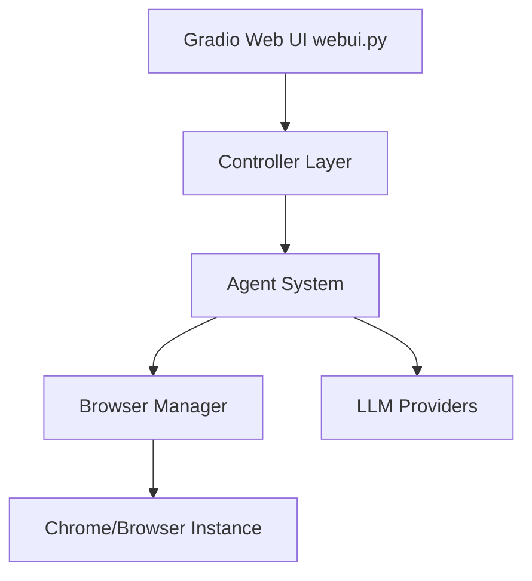

# browser-use/web-ui

> Interface Gradio pour piloter un agent browser-use sur ton propre navigateur.

## Le problème
Tester un agent qui navigue sur le web sans écrire de code, avec ses propres sessions déjà ouvertes, n'est pas simple.

## Ce que ça fait vraiment
Une interface Gradio au-dessus de `browser-use`.
Elle accepte plusieurs LLM : Google, OpenAI, Azure, Anthropic, DeepSeek, Ollama.
Elle peut utiliser ton Chrome (`BROWSER_PATH`, `BROWSER_USER_DATA`), avec une session qui persiste et un enregistrement d'écran.
En mode Docker, un VNC sur le port 6080 permet de regarder l'agent travailler.

## Comment c'est branché


## Essayer
```bash
git clone https://github.com/browser-use/web-ui.git
uv venv --python 3.11
uv pip install -r requirements.txt
playwright install --with-deps
python webui.py --ip 127.0.0.1 --port 7788
docker compose up --build
```

## Coût et pièges
Les clés de LLM sont à ta charge. Le mot de passe VNC par défaut (`youvncpassword`) doit être changé.

## Ce que ce n'est pas
Ce n'est pas une bibliothèque : c'est une démo au-dessus de browser-use. Ce n'est pas fait pour tourner sans supervision en production.

## Alternatives
Le README ne nomme que `browser-use`, dont c'est l'interface.

## Pour toi
À surveiller : pratique pour prototyper un agent web en quelques minutes, mais le vrai sujet reste la bibliothèque browser-use qui est dessous.
