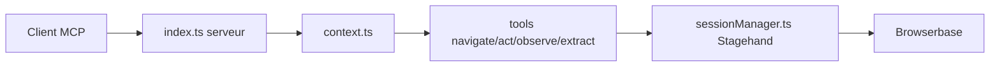

# browserbase/mcp-server-browserbase

> Serveur MCP archivé qui pilote un navigateur cloud Browserbase via Stagehand.

## Le problème
Permettre à un LLM de naviguer, observer et extraire des données de pages web via un protocole standard.

## Ce que ça fait vraiment
Expose six outils MCP (`start`, `end`, `navigate`, `act`, `observe`, `extract`) qui pilotent des sessions Browserbase avec Stagehand. Transports STDIO et HTTP. Le modèle par défaut est Gemini 2.5 Flash Lite, remplaçable avec `--modelName` et `--modelApiKey`. Le README indique que le dépôt est archivé, non maintenu, et recommande la version hébergée.

## Comment c'est branché


## Essayer
```bash
npx @browserbasehq/mcp
git clone https://github.com/browserbase/mcp-server-browserbase.git
cd mcp-server-browserbase
npm install && npm run build
```
Variables requises : `BROWSERBASE_API_KEY`, `BROWSERBASE_PROJECT_ID`, `GEMINI_API_KEY`.

## Coût et pièges
Compte Browserbase et clés à ta charge ; les options proxies et Verified dépendent du plan (Verified : plan Scale). Dépôt archivé, donc plus de correctifs.

## Ce que ce n'est pas
Pas représentatif des services actuels de Browserbase, d'après le README lui-même.

## Alternatives
- Serveur MCP hébergé de Browserbase (`https://mcp.browserbase.com/mcp`) : recommandé par le README.

## Pour toi
À ignorer : archivé et lié à un service payant ; préfère la version hébergée ou un navigateur local.

