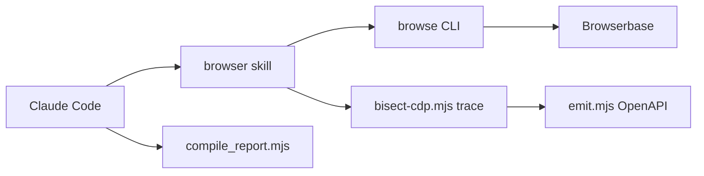

# browserbase/skills

> Plugin Claude Code de skills d'automatisation de navigateur via Browserbase et la CLI `browse`.

## Le problème
Un agent de code ne navigue pas sur le web, ne teste pas une UI et ne mène pas de recherche commerciale sans outils dédiés.

## Ce que ça fait vraiment
Une vingtaine de skills : pilotage de navigateur (sessions Browserbase distantes ou locales), fonctions serverless, capture de traces CDP, génération d'une spec OpenAPI depuis le trafic, amélioration automatique de la navigation, tests d'UI adversariaux, WebMCP, synchronisation des cookies Chrome, `fetch` et `search`, et trois workflows de recherche commerciale (entreprises, événements, concurrents). Fonctionne avec des scripts `.mjs`.

## Comment c'est branché


## Essayer
```bash
npx skills add browserbase/skills
/plugin marketplace add browserbase/skills
/plugin install browse@browserbase
```

## Coût et pièges
Les sessions distantes, proxies résidentiels, CAPTCHA et vérification d'identité passent par un compte Browserbase ; le README ne donne pas les tarifs. Aucune licence déclarée au catalogue.

## Ce que ce n'est pas
Pas autonome du SaaS : beaucoup de skills supposent Browserbase. Le mode `--local` évite le cloud pour les tests sur localhost.

## Alternatives
Aucune alternative citée dans le README.

## Pour toi
À ignorer : couplé à un service commercial et sans licence, alors que l'automatisation de navigateur locale suffit à la plupart des besoins data.

