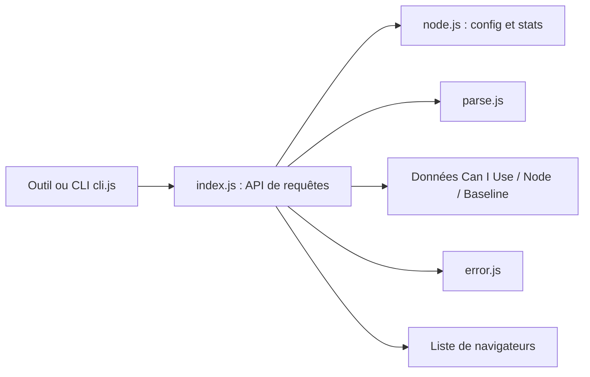

# browserslist/browserslist

> Configuration partagée des navigateurs et versions Node.js ciblés, lue par les outils front-end.

## Le problème
Chaque outil front-end (préfixes CSS, transpileur, linter) voudrait sa propre liste de navigateurs cibles, d'où des incohérences.

## Ce que ça fait vraiment
Lit une requête (`.browserslistrc`, clé `browserslist` du `package.json` ou variable `BROWSERSLIST`), la résout contre les données Can I Use, Node.js et Baseline, et renvoie la liste des versions ciblées. Propose aussi un calcul de couverture et des statistiques d'usage personnalisées (Plausible, Google Analytics).

## Comment c'est branché


## Essayer
```bash
npx browserslist
npx browserslist '> 0.3%, not dead'
browserslist --coverage "> 1%"
```

## Coût et pièges
Gratuit. Les données `caniuse-lite` vieillissent : il faut lancer `update-browserslist-db` régulièrement.

## Ce que ce n'est pas
Ce n'est pas un transpileur ni un polyfill : il liste seulement des cibles. Ce sont d'autres outils qui les appliquent.

## Alternatives
- browserslist-rs : portage en Rust.
- browserslist-useragent : tester un user-agent contre une requête.

## Pour toi
À ignorer en profil data/IA : tu ne le toucheras qu'indirectement via un outillage front-end, sans rien à configurer.

