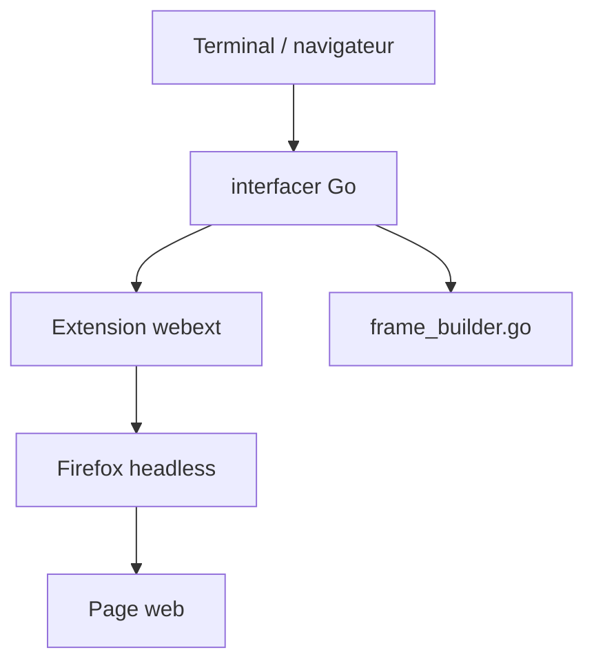

# browsh-org/browsh

> Navigateur en mode texte adossé à Firefox headless, rendu dans un terminal ou un autre navigateur.

## Le problème
Sur une connexion très lente, un navigateur graphique est inutilisable et les navigateurs texte classiques ne gèrent pas JavaScript ni HTML5.

## Ce que ça fait vraiment
Un Firefox headless charge la page côté serveur ; une extension Web convertit le rendu en grille de texte, un programme Go (`interfacer`) la sert au terminal via TTY ou à un navigateur. On peut s'y connecter en SSH ou Mosh, ce qui économise bande passante et batterie. Le client navigateur n'a pas la parité fonctionnelle avec le client terminal.

## Comment c'est branché


## Essayer
```bash
docker run --rm -it browsh/browsh
go run ./cmd/browsh --debug
```

## Coût et pièges
Gratuit. Il faut Firefox installé (binaire de ~11 Mo) ou l'image Docker (~230 Mo). Dernier push en juillet 2025.

## Ce que ce n'est pas
Ce n'est pas un navigateur léger : il consomme un Firefox complet, mais ailleurs que sur ta machine.

## Alternatives
elinks (cité), qui ne gère pas le JavaScript moderne, et VNC, moins adapté aux très mauvaises connexions.

## Pour toi
À ignorer : curiosité utile en SSH sur serveur distant, sans rapport direct avec un travail data/IA.

