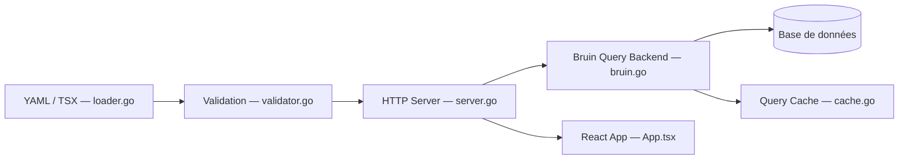

# bruin-data/dac

> Outil en ligne de commande pour définir des tableaux de bord en YAML ou TSX, versionnables et relisibles.

## Le problème
Les tableaux de bord se construisent en clics dans une interface BI : difficiles à relire, à versionner et à faire produire de façon fiable par un agent IA.

## Ce que ça fait vraiment
DAC charge des dashboards décrits en YAML ou TSX, les valide, puis les sert via une API Go et une interface React. Une couche sémantique (`semantic/`) définit métriques et dimensions une fois et génère le SQL. Les requêtes passent par `bruin query`, donc par vos connexions Bruin existantes. Il peut aussi importer du Metabase et exporter en statique ou en slides.

## Comment c'est branché


## Essayer
```bash
curl -LsSf https://getbruin.com/install/dac | sh
dac init my-dashboards
cd my-dashboards
dac validate --dir .
dac serve --dir . --open
```

## Coût et pièges
Gratuit, mais dépend du CLI Bruin (installé par le script) et de connexions Bruin configurées. Télémétrie anonyme active : désactivable avec `TELEMETRY_OPTOUT=1` ou `DO_NOT_TRACK=1`.

## Ce que ce n'est pas
Pas un outil BI clés en main à clics : tout est code. Licence AGPL-3.0 : contraignante si vous le servez en SaaS modifié. Le README dit lui-même que l'exécution des requêtes passe par un appel externe (`shells out`).

## Alternatives
Metabase : interface graphique, dont DAC sait importer le contenu.

## Pour toi
À surveiller : l'idée « dashboard as code » relisible par un agent est utile en data, mais le projet a moins d'un an, dépend de Bruin et l'AGPL peut gêner.

