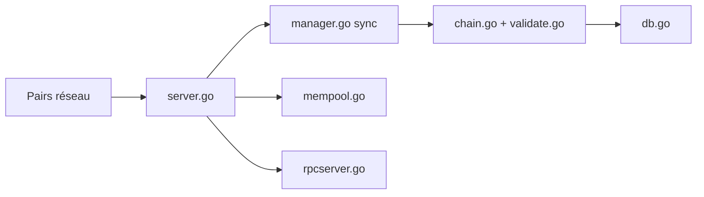

# btcsuite/btcd

> Nœud complet Bitcoin écrit en Go, sans portefeuille, pour valider et relayer la chaîne.

## Le problème
Faire tourner un nœud Bitcoin ne se limite pas à Bitcoin Core ; il faut une implémentation indépendante et modulaire pour intégrer la validation de la chaîne dans d'autres programmes.

## Ce que ça fait vraiment
Télécharge, valide et sert la chaîne selon les mêmes règles de consensus que Bitcoin Core, relaie blocs et transactions, tient un pool de transactions. Expose un serveur JSON-RPC, un indexeur de chaîne et un mineur CPU. Aucun portefeuille : celui-ci est fourni par btcwallet et Paymetheus.

## Comment c'est branché


## Essayer
```bash
go version
go install -v . ./cmd/...
./btcd
```

## Coût et pièges
Gratuit. Requiert Go 1.25 ou plus (README) ; la chaîne complète occupe du disque et de la bande passante (non chiffré dans le README). Prérequis : une toolchain Go, pas Python.

## Ce que ce n'est pas
Ce n'est pas un portefeuille : on ne peut ni envoyer ni recevoir de paiements directement. Le README le qualifie de bêta, tout en le disant stable depuis 2013.

## Alternatives
Bitcoin Core : référence dont btcd reprend les règles de consensus.

## Pour toi
Ignorer : un nœud Bitcoin en Go n'a pas d'utilité pour un profil data/IA/MLOps, sauf projet blockchain précis.

