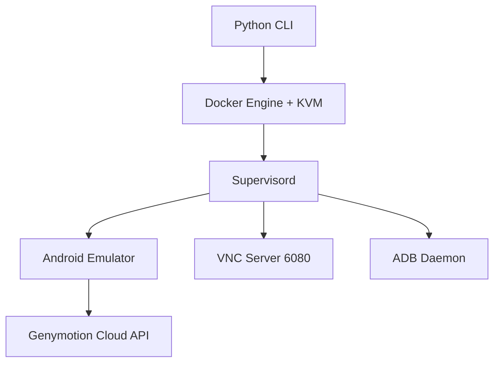

# budtmo/docker-android

> Images Docker d'émulateurs Android, avec VNC et ADB, pour les tests et la CI.

## Le problème
Faire tourner un émulateur Android reproductible dans une CI, sans poste de développement, est pénible.

## Ce que ça fait vraiment
Images `emulator_9.0` à `14.0` avec des profils d'appareils (Galaxy, Nexus, Pixel C).
VNC web sur le port 6080, ADB accessible de l'extérieur, logs dans une interface web, persistance via un volume.
Il permet de lancer des tests Appium et Espresso et s'intègre à Genymotion Cloud.
Une CLI Python orchestre le tout sous supervisord. Serveur MCP et agent IA en bêta.

## Comment c'est branché


## Essayer
```bash
sudo apt install cpu-checker
kvm-ok
docker run -d -p 6080:6080 -e EMULATOR_DEVICE="Samsung Galaxy S10" -e WEB_VNC=true --device /dev/kvm --name android-container budtmo/docker-android:emulator_11.0
docker exec -it android-container cat device_status
```

## Coût et pièges
Il faut KVM, donc Ubuntu ou une VM sous Linux. Android 15 et plus, le mode headless et l'agent IA sont réservés à la version Pro, accessible aux sponsors. La version normale inclut de l'analyse du comportement des utilisateurs.

## Ce que ce n'est pas
Ce n'est pas une ferme d'appareils réels. Il ne tourne pas nativement sur macOS ou Windows.

## Alternatives
Le README ne nomme aucun dépôt alternatif.

## Pour toi
À ignorer : c'est de l'outillage de test mobile, loin de tes sujets data/IA.
