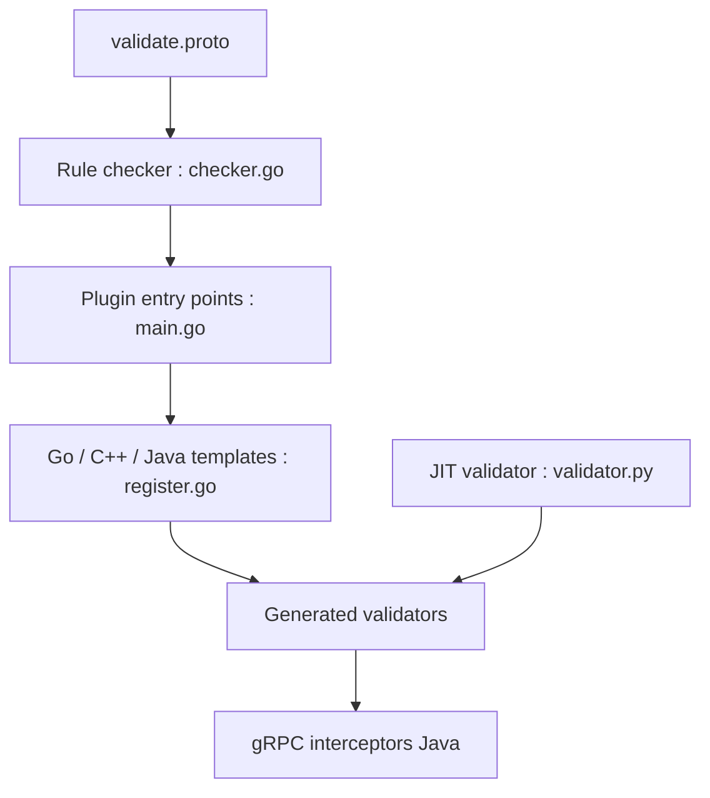

# bufbuild/protoc-gen-validate

> Plugin protoc qui génère des validateurs de messages protobuf à partir de règles écrites dans les fichiers proto.

## Le problème
Protobuf garantit les types, pas les règles sémantiques (email valide, plage de valeurs).

## Ce que ça fait vraiment
On annote les champs avec `(validate.rules)`. Le plugin génère des méthodes `Validate()` et `ValidateAll()` en Go, partiellement en C++, du code Java avec intercepteurs gRPC, et Python par génération à l'exécution. Il vérifie que les règles ne se contredisent pas. Seul proto3 est géré.

## Comment c'est branché


## Essayer
```bash
git clone https://github.com/bufbuild/protoc-gen-validate.git
cd protoc-gen-validate && make build
protoc -I . -I path/to/validate/ --go_out=":../generated" --validate_out="lang=go:../generated" example.proto
```

## Coût et pièges
Gratuit. Dépôt archivé, en mode maintenance. Le module Go garde le chemin `envoyproxy`, volontairement.

## Ce que ce n'est pas
Pas le choix recommandé pour un nouveau projet : le README conseille `protovalidate`.

## Alternatives
- protovalidate : successeur recommandé par les auteurs, avec guide de migration.

## Pour toi
À ignorer pour du neuf : archivé, remplacé par protovalidate ; ne le garde que sur un code existant qui en dépend.

