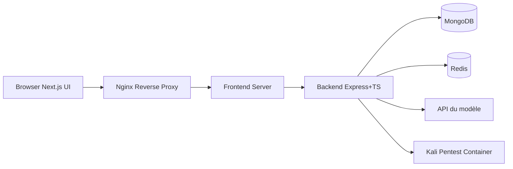

# bugbasesecurity/pentest-copilot

> Agent IA open source qui pilote une machine Kali pour assister des tests d'intrusion autorisés, pour pentesteurs et joueurs de CTF.

## Le problème
Un test d'intrusion enchaîne beaucoup de commandes, de lectures de sorties et d'outils à installer. Le travail répétitif ralentit l'analyse.

## Ce que ça fait vraiment
- Une boucle d'agent (jusqu'à 25 itérations par tour) exécute des commandes sur une machine Kali, lit les sorties et décide de la suite.
- 16 outils d'agent : shell, scripts Python, installation d'outils, recherche web, sous-agents, Burp Suite, navigation automatisée.
- Modèle au choix : OpenAI, Anthropic, Google, Mistral, endpoint compatible OpenAI, ou CLI Codex / Claude Code déjà authentifiés.
- Les commandes dangereuses demandent une approbation explicite ; un accès MCP local est proposé.

## Comment c'est branché


## Essayer
```bash
git clone https://github.com/bugbasesecurity/pentest-copilot.git
cd pentest-copilot
./run.sh start
# puis http://localhost:3000, Settings -> Models
./run.sh stop
```

## Coût et pièges
Clé d'API d'un fournisseur de modèle à ta charge (ou abonnement Codex / Claude Code local). 8 Go de RAM minimum, +2 Go avec le conteneur Kali, 20 Go de disque. Le jeton MCP équivaut à un accès administrateur local.

## Ce que ce n'est pas
Ce n'est pas un outil à pointer sur un système sans autorisation : le README limite l'usage aux tests autorisés. Ce n'est pas un service exposable tel quel : ports liés à 127.0.0.1, sans TLS ni authentification prévus pour un réseau ouvert. Sous Windows, WSL2 est obligatoire.

## Alternatives
Aucune alternative nommée dans le README.

## Pour toi
À surveiller : intéressant pour voir comment un agent LLM orchestre des outils avec consentement humain, mais utile seulement si tu as un cadre légal d'audit ou un labo CTF.
