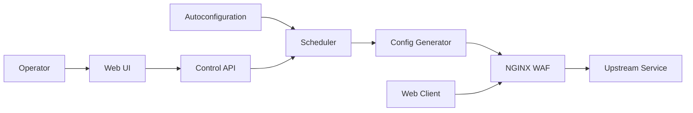

# bunkerity/bunkerweb

> Pare-feu applicatif web (WAF) basé sur NGINX, déployé en reverse proxy devant tes services.

## Le problème
Durcir un reverse proxy (TLS, en-têtes, ModSecurity, anti-bots, limites) demande beaucoup de configuration manuelle et d'expertise.

## Ce que ça fait vraiment
NGINX préconfiguré avec ModSecurity + OWASP CRS, Let's Encrypt automatique, bannissement sur codes HTTP, challenges anti-bots, listes noires.
Configuration par variables (`USE_ANTIBOT`, `AUTO_LETS_ENCRYPT`…), multisite, conf NGINX custom.
Un scheduler stocke l'état en base (SQLite/MariaDB/MySQL/PostgreSQL) et génère la config ; UI web, CLI, API.
Autoconf pour Docker, Swarm, Kubernetes (Ingress) ; plugins (ClamAV, Coraza, VirusTotal, webhooks).

## Comment c'est branché


## Essayer
Aucune commande d'installation dans le README : renvoi vers les sections Linux/Docker/Kubernetes de la doc. Exemple de config :
```bash
SERVER_NAME=www.example.com
AUTO_LETS_ENCRYPT=yes
USE_ANTIBOT=captcha
```

## Coût et pièges
Open source AGPLv3 ; version PRO payante et offre Cloud SaaS. Faux positifs WAF à régler (security tuning).

## Ce que ce n'est pas
Pas une solution « posée et oubliée » : les défauts donnent un minimum, le réglage est recommandé. Certaines fonctions (couronne) sont réservées au PRO.

## Alternatives
- Coraza (plugin) : moteur WAF alternatif à ModSecurity dans BunkerWeb même.

## Pour toi
À ignorer pour ton profil : outil d'infra/sécurité web, utile seulement si tu exposes toi-même une API de modèle sans équipe ops.
