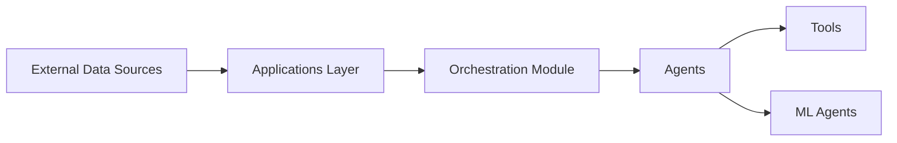

# business-science/ai-data-science-team

> Bibliothèque d'agents spécialisés pour workflows de data science, avec une application Streamlit de pipelines.

## Le problème
Les tâches répétitives de data science (chargement, nettoyage, visualisation, modélisation) prennent du temps.

## Ce que ça fait vraiment
Agents Python pour charger, nettoyer, transformer, visualiser, faire de l'EDA et du feature engineering, interroger une base SQL, et modéliser avec H2O et MLflow. Des multi-agents et un agent superviseur les combinent. L'app AI Pipeline Studio garde un lignage reproductible avec éditeur visuel, tables, graphiques et scripts. Fonctionne avec OpenAI ou Ollama.

## Comment c'est branché


## Essayer
```bash
pip install -e .
streamlit run apps/ai-pipeline-studio-app/app.py
```

## Coût et pièges
Clé OpenAI ou serveur Ollama local. Python 3.10+. Le code généré par LLM est exécuté : à relire.

## Ce que ce n'est pas
Statut bêta : « Breaking changes may occur until 0.1.0 ». Le dernier push date de janvier 2026. Le README fait aussi la promotion d'un atelier payant.

## Alternatives
Le README ne nomme aucune alternative.

## Pour toi
À surveiller : bon terrain d'essai pour un data scientist, mais bêta et un seul auteur ; ne pas le mettre au cœur d'un pipeline.
