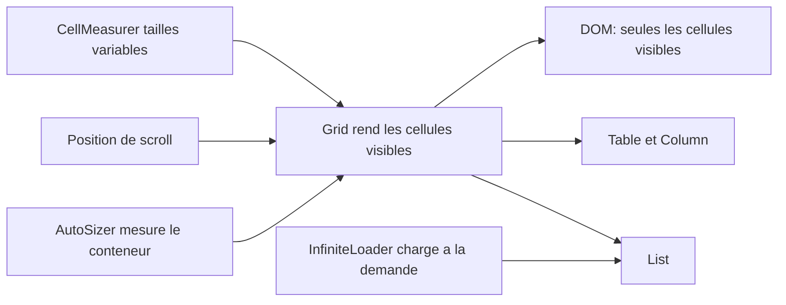

# bvaughn/react-virtualized

> **React components that render very large lists and tables without mounting every row.**

## The problem

Rendering ten thousand rows in a React page bloats the DOM and makes scrolling stutter.
Without virtualization you pay the render cost of every row while the user only ever sees
about twenty of them at a time.

## What it actually does

It ships a set of components that render only the visible cells: `Grid`, `List`, `Table`
with its `Column`, plus `Collection`, `Masonry` and `MultiGrid`. Around them sit
composition helpers: `AutoSizer` to pick up the container size, `CellMeasurer` for
variable-height cells, `ColumnSizer`, `InfiniteLoader` for load-on-demand, `ScrollSync`,
`WindowScroller` and `ArrowKeyStepper`. Most styles are functional (position, size) and
applied straight to DOM elements; only `Table` carries a few presentational styles, in an
optional `styles.css` that you import once during app bootstrap.

By default every component uses `shallowCompare` and will not re-render unless props or
state change, which is why the README documents pass-thru props and the
`forceUpdateGrid` / `forceUpdateGrids` methods.

## How it is wired



`Grid` is the core: given a container size and a scroll position, it emits only the
visible window of cells. `List`, `Table` and `MultiGrid` wrap one or more inner `Grid`
instances — hence the README's instruction to call `forceUpdateGrid` or
`forceUpdateGrids` on those rather than plain `forceUpdate`. `AutoSizer`, `CellMeasurer`
and `InfiniteLoader` feed the grid with dimensions or data.

## Trying it

```shell
npm install react-virtualized --save
```

```js
import 'react-virtualized/styles.css';
import {Column, Table} from 'react-virtualized';

// targeted imports to keep the bundle small
import AutoSizer from 'react-virtualized/dist/commonjs/AutoSizer';
import List from 'react-virtualized/dist/commonjs/List';
```

A UMD build is documented too:

```html
<link rel="stylesheet" href="path-to-react-virtualized/styles.css" />
<script src="path-to-react-virtualized/dist/umd/react-virtualized.js"></script>
```

## Cost and traps

Free, MIT, no API key and no third-party service. The costs are elsewhere: `react` and
`react-dom` are peer dependencies your project must declare, npm will not install them
for you. Bundle size is an acknowledged concern, which is why the README offers targeted
`dist/commonjs` imports or a Webpack alias — webpack 4 does this optimization on its own.
The classic trap is `shallowCompare`: a re-sorted list, or an array whose contents change
without its length changing, will not re-render unless you pass an extra prop or force
the update. IE 9 is listed as supported but needs custom CSS since flexbox is missing.

## What it is not

It is not a turnkey data grid: no sorting, filtering or pagination are provided — `Table`
renders cells and the logic stays yours, with separate how-to guides for natural sort and
multi-column sort. It is also not the author's own default recommendation: the README
opens by suggesting `react-window` as a lighter-weight alternative. And it is not
framework-agnostic — it is a React component library, nothing reusable elsewhere.

## Alternatives

- **bvaughn/react-window** — named at the top of the README as the lighter alternative by
  the same author; prefer it for a plain virtualized list or grid.
- **bvaughn/react-virtualized-select** — built on top of it, when the need is precisely a
  dropdown with a very large number of options.
- **clauderic/react-sortable-hoc** — listed under "Friends", when the real need is a
  reorderable list rather than a long one.

The catalogue neighbours (DavidHDev/react-bits, Asabeneh/30-Days-Of-React,
lucide-icons/lucide) are not comparable: collections of snippets or icons, not
virtualized rendering engines.

## For you

Worth knowing as soon as a dashboard or dataset explorer has to show tens of thousands of
rows in a React UI, a common case for internal data tooling. For a new project, start
with `react-window` as the author suggests and only come back here if `CellMeasurer`,
`MultiGrid` or `Masonry` are genuinely needed.
