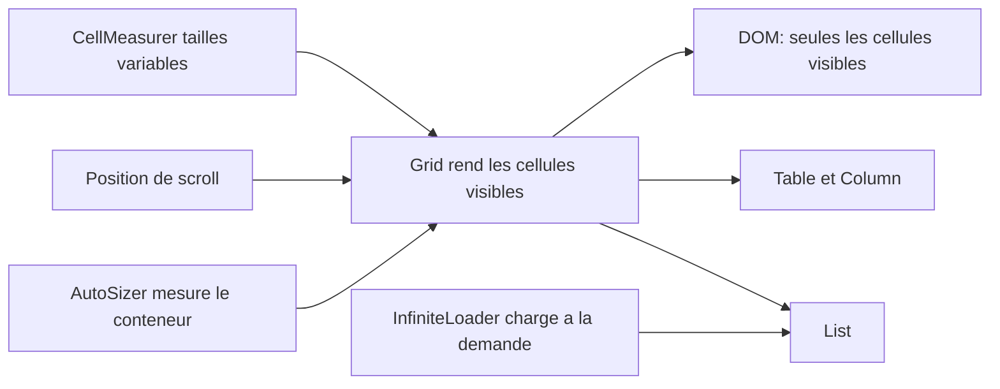

# bvaughn/react-virtualized

> **Composants React pour afficher de très grandes listes et tableaux sans tout monter dans le DOM.**

## Le problème

Rendre dix mille lignes dans une page React fait gonfler le DOM et le scroll devient
saccadé. Sans virtualisation, on paie le coût de rendu de toutes les lignes alors que
l'utilisateur n'en voit qu'une vingtaine à la fois.

## Ce que ça fait vraiment

La bibliothèque fournit un jeu de composants qui ne rendent que les cellules visibles :
`Grid`, `List`, `Table` avec ses `Column`, `Collection`, `Masonry`, `MultiGrid`. Autour,
des utilitaires de composition : `AutoSizer` pour prendre la taille du conteneur,
`CellMeasurer` pour mesurer des cellules de hauteur variable, `ColumnSizer`,
`InfiniteLoader` pour charger à la demande, `ScrollSync`, `WindowScroller`,
`ArrowKeyStepper`. Les styles sont pour l'essentiel fonctionnels (position, taille) et
appliqués directement aux éléments du DOM ; seul `Table` embarque quelques styles de
présentation, dans un `styles.css` optionnel à importer une fois.

Par défaut, tous les composants utilisent `shallowCompare` et ne se re-rendent pas si les
props ou le state n'ont pas changé — d'où le besoin de passer une prop supplémentaire
(`sortBy` par exemple) ou d'appeler `forceUpdateGrid` / `forceUpdateGrids` quand les
données changent sans que les props changent.

## Comment c'est branché



Le cœur est `Grid` : il reçoit une taille de conteneur, une position de scroll, et ne
produit que la fenêtre de cellules visible. `List`, `Table` et `MultiGrid` sont des
enveloppes autour d'une ou plusieurs `Grid` internes — c'est pour cela que le README
impose `forceUpdateGrid` / `forceUpdateGrids` plutôt que `forceUpdate` sur ces
composants-là. `AutoSizer`, `CellMeasurer` et `InfiniteLoader` sont des composants de
composition qui alimentent la grille en dimensions ou en données.

## Essayer

```shell
npm install react-virtualized --save
```

```js
import 'react-virtualized/styles.css';
import {Column, Table} from 'react-virtualized';

// import ciblé pour limiter la taille du bundle
import AutoSizer from 'react-virtualized/dist/commonjs/AutoSizer';
import List from 'react-virtualized/dist/commonjs/List';
```

Un build UMD est aussi documenté :

```html
<link rel="stylesheet" href="path-to-react-virtualized/styles.css" />
<script src="path-to-react-virtualized/dist/umd/react-virtualized.js"></script>
```

## Coût et pièges

Gratuit, MIT, aucune clé d'API ni service tiers. Les vrais coûts sont ailleurs :
`react` et `react-dom` sont des peer dependencies que le projet doit déclarer lui-même,
npm ne les installe pas. La taille de bundle est un sujet assumé par le README, qui
propose des imports ciblés depuis `dist/commonjs` ou un alias Webpack — webpack 4 fait
cette optimisation seul. Le piège classique est le `shallowCompare` : une liste re-triée
ou un tableau dont le contenu change sans que la longueur change ne se re-rend pas, il
faut passer une prop pass-thru ou forcer la mise à jour. Enfin, IE 9 est annoncé comme
supporté mais exige du CSS maison, flexbox n'y étant pas disponible.

## Ce que ce n'est pas

Ce n'est pas un composant de tableau clé en main : pas de tri, de filtrage ni de
pagination fournis — `Table` rend des cellules, la logique reste à écrire (le README
renvoie à des guides séparés pour le tri naturel ou multi-colonnes). Ce n'est pas non
plus le choix par défaut recommandé par son propre auteur : le README ouvre en suggérant
d'envisager `react-window`, plus léger. Et ce n'est pas indépendant de React : c'est une
bibliothèque de composants React, rien d'utilisable ailleurs.

## Alternatives

- **bvaughn/react-window** — cité dès le haut du README comme alternative plus légère du
  même auteur ; à préférer pour un besoin simple de liste ou grille virtualisée.
- **bvaughn/react-virtualized-select** — bâti dessus, si le besoin est précisément un
  menu déroulant à très grand nombre d'options.
- **clauderic/react-sortable-hoc** — cité dans les « Friends », si le besoin réel est une
  liste réordonnable plutôt qu'une liste longue.

Les voisins du catalogue (DavidHDev/react-bits, Asabeneh/30-Days-Of-React,
lucide-icons/lucide) ne sont pas comparables : ce sont des collections d'exemples ou
d'icônes, pas des moteurs de rendu virtualisé.

## Pour toi

Utile dès qu'un dashboard ou un explorateur de dataset doit afficher des dizaines de
milliers de lignes dans une interface React — cas fréquent côté outillage data interne.
Pour un nouveau projet, commencer par `react-window` comme le suggère l'auteur, et ne
venir ici que si `CellMeasurer`, `MultiGrid` ou `Masonry` manquent vraiment.
