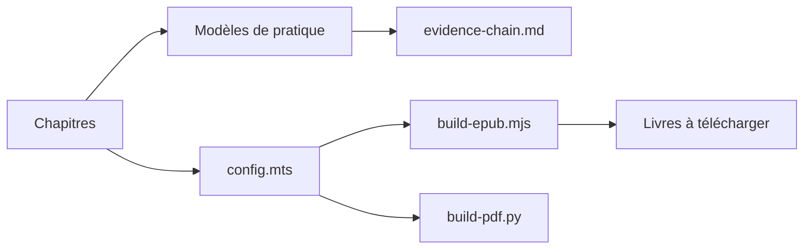

# byoungd/up

> Livre chinois en accès libre sur l'apprentissage tout au long de la vie à l'ère de l'IA.

## Le problème
Le texte s'adresse à des personnes qui veulent continuer à apprendre malgré le changement rapide, en s'aidant de l'IA sans lui déléguer leur jugement.

## Ce que ça fait vraiment
Manuscrit mis à jour, en chinois avec version anglaise, publié en site (VitePress) et en EPUB/PDF. Cinq parties : lire, se replacer dans la vie, outils dont l'IA, pratique et récupération, action sur 90 jours. Il propose des modèles de suivi et un cycle « problème, apprentissage, IA, tâche réelle, preuve, bilan ». L'auteur indique un lien commercial avec sa société.

## Comment c'est branché

## Essayer
Aucune commande documentée : lire le site GitHub Pages ou télécharger les livres.

## Coût et pièges
Gratuit. Licences déclarées dans le README : contenu CC BY-NC 4.0, code et configuration MIT ; GitHub ne les identifie pas. Le texte est en chinois.

## Ce que ce n'est pas
Ce n'est pas un logiciel ni un cours technique en IA, et le README précise que ce n'est pas un conseil médical, juridique ou d'investissement.

## Alternatives
Aucune alternative nommée dans le README.

## Pour toi
Ignorer : lecture personnelle sans contenu outillé pour ton travail, et licence non commerciale sur le texte.

