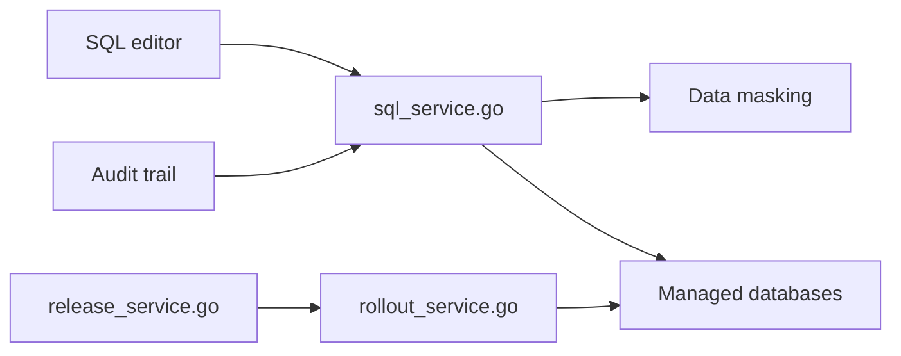

# bytebase/bytebase

> Plateforme de gouvernance de bases de données : changements, accès et conformité pour équipes et agents IA.

## Le problème
Scripts de migration, clients SQL et tickets dispersés : qui a changé ou lu quoi reste flou.

## Ce que ça fait vraiment
Console web pour demander, relire, déployer et annuler des changements de schéma ; revue SQL (200+ règles de lint) ; GitOps GitHub/GitLab ; RBAC, accès à durée limitée, masquage dynamique de colonnes ; journal d'audit. Côté IA : serveur MCP, text-to-SQL, agent intégré.

## Comment c'est branché


## Essayer
```bash
docker run --init \
  --name bytebase \
  --publish 8080:8080 \
  --volume ~/.bytebase/data:/var/opt/bytebase \
  bytebase/bytebase:latest
```

## Coût et pièges
Version gratuite, avec offres payantes non détaillées dans le README. Licence présente mais non identifiée par GitHub.

## Ce que ce n'est pas
Ce n'est pas un outil de migration seul : c'est un plan de contrôle complet, donc lourd pour un petit projet.

## Alternatives
Comparaisons listées dans le README : Liquibase, Flyway, DBeaver, DataGrip, Navicat, CloudBeaver, Jira.

## Pour toi
Surveiller : utile si plusieurs personnes ou agents touchent aux bases de prod ; licence à vérifier.

