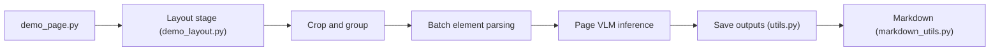

# bytedance/Dolphin

> Modèle d'analyse d'images de documents en deux étapes : mise en page puis parsing des éléments.

## Le problème
Les pages mêlent texte, tableaux, formules et code, photographiées ou natives ; les extraire proprement avec l'ordre de lecture est difficile.

## Ce que ça fait vraiment
Étape 1 : classification du type de document (natif ou photographié) et analyse de mise en page avec ordre de lecture. Étape 2 : parsing global pour les photos, parsing parallèle élément par élément pour les documents numériques. Sorties JSON et Markdown. Trois scripts : page, mise en page, élément. Dolphin-v2 (3B) annonce 89,78 sur OmniDocBench v1.5 d'après le README.

## Comment c'est branché


## Essayer
```bash
git clone https://github.com/ByteDance/Dolphin.git
cd Dolphin
pip install -r requirements.txt
git clone https://huggingface.co/ByteDance/Dolphin-v2 ./hf_model
python demo_page.py --model_path ./hf_model --save_dir ./results --input_path ./demo/page_imgs/page_1.png
```

## Coût et pièges
Gratuit, mais poids du modèle à télécharger et GPU probable (non précisé). Licence présente mais non identifiée : à lire avant tout usage commercial.

## Ce que ce n'est pas
Pas un service prêt à l'emploi ; scripts de démonstration. Dernier push en mars 2026.

## Alternatives
Aucune nommée dans le README (benchmark sur OmniDocBench).

## Pour toi
À surveiller : utile pour pipelines RAG sur PDF/scans, mais vérifier la licence et mesurer sur tes documents.

