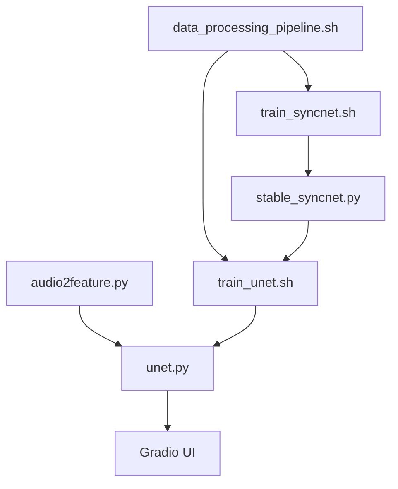

# bytedance/LatentSync

> Modèle de synchronisation labiale par diffusion latente conditionnée par l'audio, avec code d'entraînement.

## Le problème
Les méthodes de lip-sync par diffusion en espace pixel ou en deux étapes sont lourdes et produisent des artefacts temporels.

## Ce que ça fait vraiment
Whisper encode l'audio, injecté par cross-attention dans un U-Net type Stable Diffusion avec images de référence et masquées.
Pertes TREPA, LPIPS et SyncNet en espace pixel pendant l'entraînement.
Inférence par app Gradio ou script ; pipeline complet de préparation des données (scènes, visages InsightFace, filtrage sync et qualité).
Scripts d'entraînement U-Net et SyncNet, et d'évaluation.

## Comment c'est branché


## Essayer
```bash
source setup_env.sh
python gradio_app.py
./inference.sh
./data_processing_pipeline.sh
./train_unet.sh
```

## Coût et pièges
Inférence : 8 Go de VRAM (v1.5) à 18 Go (v1.6) ; entraînement 20 à 55 Go selon la config.

## Ce que ce n'est pas
Pas un service prêt à l'emploi ni une solution temps réel. L'usage sur des visages réels pose des questions de consentement (deepfake).

## Alternatives
Aucune alternative nommée dans le README.

## Pour toi
À surveiller : référence open source solide pour la vidéo générative, mais sans commit depuis plus d'un an et hors du cœur data/MLOps.
