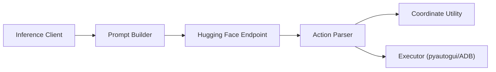

# bytedance/UI-TARS

> Modèle vision-langage qui pilote des interfaces graphiques à partir de captures d'écran.

## Le problème
Automatiser des tâches sur un bureau, un navigateur ou un téléphone demande un agent qui comprenne l'écran et agisse.

## Ce que ça fait vraiment
Le modèle reçoit une capture et produit « Thought » et « Action ». Le paquet `ui-tars` analyse cette sortie et la convertit en code pyautogui, avec conversion de coordonnées. Trois gabarits de prompt : `COMPUTER_USE`, `MOBILE_USE`, `GROUNDING`. Le modèle se déploie via un endpoint Hugging Face.

## Comment c'est branché


## Essayer
```bash
pip install ui-tars
```
Le README donne ensuite un exemple Python avec `parse_action_to_structure_output`.

## Coût et pièges
Le README indique des ressources de calcul importantes ; la taille exacte du GPU n'est pas donnée. Le modèle 1.5 le plus performant n'est proposé qu'en accès recherche.

## Ce que ce n'est pas
Pas un agent prêt à l'emploi : les versions de bureau et navigateur sont dans d'autres dépôts (UI-TARS-desktop, Midscene). Les auteurs signalent risques de mésusage et d'hallucinations. Dernier push le 2026-01-27.

## Alternatives
Midscene.js, cité pour l'automatisation web ; UI-TARS-desktop pour l'appareil local.

## Pour toi
Surveiller : référence pour les agents d'usage d'ordinateur, mais brique partielle et nécessitant du déploiement de modèle.

