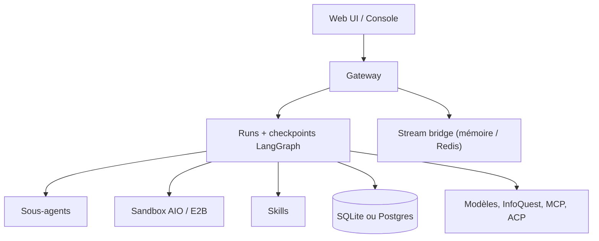

# bytedance/deer-flow

> Harnais d'agent orchestrant sous-agents, mémoire et sandboxes, extensible par skills, signé ByteDance.

## Le problème
Un agent seul sature son contexte sur une tâche longue et n'a pas d'endroit sûr où exécuter du code.
Faire coopérer plusieurs agents, avec reprise après incident, demande une infrastructure complète.

## Ce que ça fait vraiment
Orchestre des sous-agents avec plafonds configurables, une mémoire persistée et des sandboxes d'exécution.
Assistant de configuration `make setup` qui génère `config.yaml` et `.env` en deux minutes.
Modèles configurables en YAML ou depuis l'interface ; fournisseurs adossés à une CLI (Codex, Claude Code OAuth) et agents ACP.
Persistance par SQLite ou Postgres, reprise par checkpoints LangGraph, diffusion SSE avec relecture bornée.

## Comment c'est branché


## Essayer
```bash
git clone https://github.com/bytedance/deer-flow.git
cd deer-flow && make setup
make doctor
make docker-init && make docker-start
```

## Coût et pièges
Les modèles sont à ta charge. Le dimensionnement recommandé pour un serveur : 8 vCPU, 16 Go de RAM, 40 Go de disque.
`2 vCPU / 4 Go` est explicitement décrit comme insuffisant, même en évaluation locale.

## Ce que ce n'est pas
Pas un produit fini : la 2.0 est une réécriture complète, sans code commun avec la 1.x.
Pas simple à exploiter à plusieurs workers — cela exige Postgres, Redis, heartbeats et un store d'événements en base.
Le README pousse plusieurs services Volcengine/BytePlus ; l'intégration InfoQuest est maison.

## Alternatives
- `OpenHands/OpenHands` : même idée de serveur d'agents, avec une console multi-backends.
- `langflow-ai/langflow` : orchestration visuelle, beaucoup plus légère à déployer.

## Pour toi
Le plus complet des harnais du lot, et le plus lourd. À surveiller, pas à déployer sur un coup de tête.
