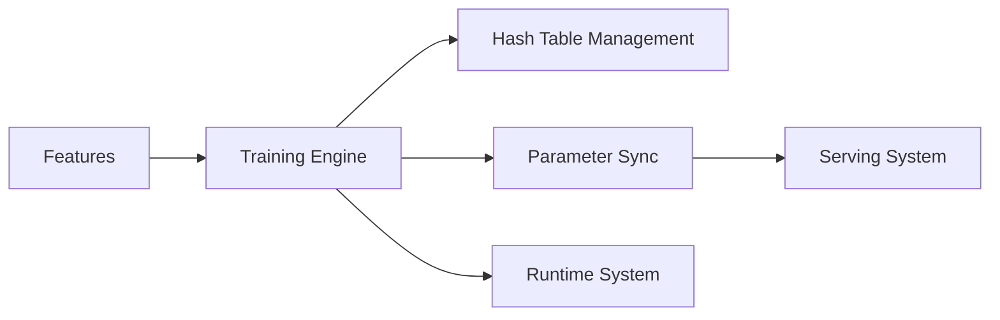

# bytedance/monolith

> Framework ByteDance d'entraînement de modèles de recommandation à grande échelle sur TensorFlow, archivé.

## Le problème
Les systèmes de recommandation à très grand nombre d'identifiants souffrent de collisions dans les tables d'embeddings et réagissent lentement aux tendances.

## Ce que ça fait vraiment
Selon le README : tables d'embeddings sans collision (représentation unique par identifiant) et entraînement temps réel, au-dessus de TensorFlow, en batch ou en continu, entraînement et service. Le schéma de GitDiagram évoque parameter servers et workers distribués, mais aucun composant n'y est lisible. Une API `MonolithModel` et un tutoriel d'entraînement asynchrone distribué sont mentionnés.

## Comment c'est branché

(Diagramme fourni sans composant lisible : nœuds repris de l'explication textuelle.)

## Essayer
```bash
pip install -U --user pip numpy wheel packaging requests opt_einsum
pip install -U --user keras_preprocessing --no-deps
bazel run //monolith/native_training:demo --output_filter=IGNORE_LOGS
```

## Coût et pièges
Compilation Linux uniquement avec Bazel 3.1.0, version ancienne à installer à la main. Dépôt archivé : plus aucun correctif.

## Ce que ce n'est pas
Pas une bibliothèque maintenue ni portable : archivée, licence non identifiée par GitHub, documentation limitée à une démo.

## Alternatives
Aucune alternative nommée dans le README.

## Pour toi
À ignorer : dépôt archivé, licence à vérifier et chaîne Bazel/TensorFlow datée ; intéressant au mieux pour lire l'idée des embeddings sans collision, pas pour construire dessus.
