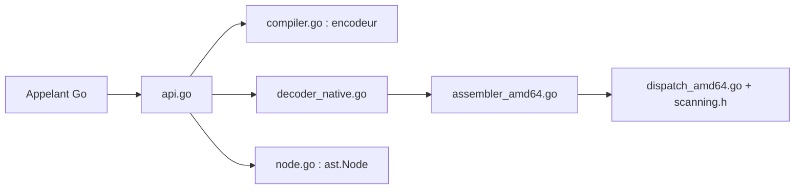

# bytedance/sonic

> Bibliothèque Go de sérialisation et désérialisation JSON, accélérée par JIT et instructions SIMD.

## Le problème
`encoding/json` de Go est lent sur de gros volumes de JSON.

## Ce que ça fait vraiment
Marshal/Unmarshal sans génération de code, avec liaison à l'exécution via un compilateur JIT. Fournit aussi un AST (`ast.Node`) à chargement paresseux pour lire, chercher et modifier du JSON, une API Visitor, des entrées/sorties en flux et des options de compatibilité. Retombe sur `encoding/json` hors des environnements supportés.

## Comment c'est branché


## Essayer
```go
import "github.com/bytedance/sonic"

output, err := sonic.Marshal(&data)
err := sonic.Unmarshal(output, &data)
```

## Coût et pièges
Gratuit. Go 1.18 à 1.27, AMD64 ou ARM64 (Go 1.20+) ; Go 1.24.0 non supporté. Le premier appel sur un très gros schéma peut être lent : utiliser `PretouchMany()`. Le pool mémoire peut augmenter la consommation.

## Ce que ce n'est pas
Ne respecte pas strictement la RFC8259 sur l'échappement HTML et le tri des clés par défaut. Les chiffres du README viennent de ses propres benchmarks sur un seul poste.

## Alternatives
- jsoniter, go-json, gjson, sjson : comparés dans les benchmarks du README.

## Pour toi
À surveiller : intéressant si ton service Go d'inférence passe beaucoup de temps à manipuler du JSON ; à mesurer sur tes propres charges avant d'adopter.

