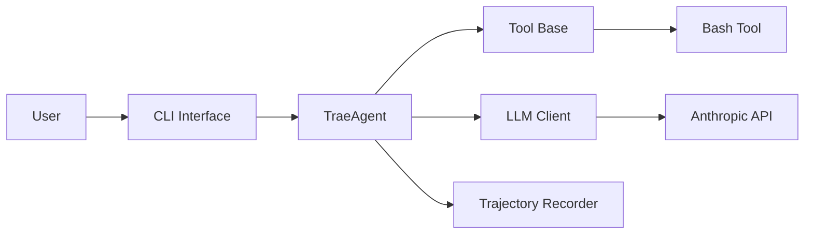

# bytedance/trae-agent

> Agent CLI de génie logiciel piloté par LLM, pensé pour la recherche sur les architectures d'agents.

## Le problème
Les agents CLI de code sont souvent opaques et difficiles à modifier pour étudier ou comparer leurs composants.

## Ce que ça fait vraiment
`trae-cli run "<tâche>"` exécute une boucle agent avec outils bash, édition de fichiers, pensée séquentielle et `task_done`.
Multi-fournisseurs : OpenAI, Anthropic, Gemini, Azure, OpenRouter, Doubao, Ollama ; config YAML + variables d'environnement.
Enregistre des trajectoires JSON détaillées (appels LLM, outils) ; résumé des étapes « Lakeview ».
Mode interactif, exécution dans un conteneur Docker, serveurs MCP optionnels.

## Comment c'est branché


## Essayer
```bash
git clone https://github.com/bytedance/trae-agent.git
cd trae-agent
uv sync --all-extras
source .venv/bin/activate
cp trae_config.yaml.example trae_config.yaml
trae-cli run "Create a hello world Python script"
```

## Coût et pièges
Clé d'API du fournisseur à ta charge, jusqu'à 200 étapes par tâche par défaut.
Le mode Docker exige Docker configuré.

## Ce que ce n'est pas
Pas un produit fini concurrent des IDE agents : l'accent est mis sur l'étude et l'ablation.
L'agent exécute du bash réel : isoler l'environnement.

## Alternatives
Aucune alternative nommée dans le README (anthropic-quickstart est cité comme référence, pas comme alternative).

## Pour toi
À surveiller si tu étudies ou évalues des agents : les trajectoires enregistrées sont exploitables pour de l'analyse, moins pour un usage quotidien.
