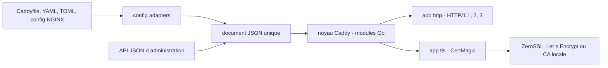

# caddyserver/caddy

> **A Go HTTPS server that obtains and renews its own certificates, configured through an API.**

## The problem

Serving a site over HTTPS usually means obtaining a certificate, renewing it before it expires
and wiring all of it into configuration scattered across a file, command-line flags and
environment variables. When renewal fails or OCSP breaks, the server goes down with it.

## What it actually does

Caddy is an HTTP server with TLS on by default: it requests certificates from ZeroSSL or
Let's Encrypt for public names and runs a fully-managed local CA for internal names and IPs,
with fallback between issuers. Several instances can coordinate as a cluster. HTTP/1.1,
HTTP/2 and HTTP/3 are served out of the box, as is Encrypted ClientHello.

Its native configuration is a single JSON document, exposed and changeable on the fly through
an API. Config adapters convert other formats into that JSON: Caddyfile, JSON 5, YAML, TOML,
NGINX config. The README also presents Caddy as a platform for running Go programs: its
"apps" (`tls` and `http` ship as standard) are Go modules, and the plugin system adds more at
build time.

The README describes itself with "production-ready", "powerful" and "highly extensible"; that
promotional vocabulary is worth flagging, the verifiable substance is what is listed above.

## How it is wired



Everything enters through a single configuration document: written directly in JSON, produced
by an adapter from another format, or pushed live through the API. The core instantiates the
Go modules that document describes; the `http` app serves traffic while the `tls` app (backed
by CertMagic, credited in the README) obtains and renews certificates from a public authority
or from Caddy's own local CA.

## Trying it

The README's recommended path is to download the executable from GitHub Releases and put it in
your PATH. To build from source (Go 1.25.0 or newer):

```bash
$ git clone "https://github.com/caddyserver/caddy.git"
$ cd caddy/cmd/caddy/
$ go build
```

Binding to low ports may need elevated privileges:

```bash
sudo setcap cap_net_bind_service=+ep ./caddy
```

Tests, then building with plugins and version information via `xcaddy`:

```bash
$ go test ./...
$ go test ./modules/caddyhttp/tracing/
$ xcaddy build
```

## Cost and traps

The software is free and has no external dependencies ("not even libc", says the README). The
traps are elsewhere. Automatic HTTPS relies on third-party certificate authorities (ZeroSSL,
Let's Encrypt): you need a resolvable public name and outbound access to them, otherwise you
fall back to the local CA, whose certificates are not trusted outside your own perimeter.
Adding plugins means recompiling with `xcaddy`, not loading a module at runtime. The README
warns that the "for development" build steps do not embed proper version information. On
support: the community forum is free, but the README advises companies to secure a paid
support contract through Ardan Labs, and reserves private help for sponsors. The name "Caddy"
is a registered trademark of Stack Holdings GmbH.

## What it is not

It is not just a reverse proxy to drop in front of an app: it is a modular platform whose JSON
configuration requires understanding its structure — the README insists that every user, at
any experience level, go through the Getting Started guide. It is not a standalone certificate
manager either: that part is CertMagic, a separate project. Finally, the README documents
almost nothing in depth and constantly points to caddyserver.com; you cannot operate Caddy
from the repository alone.

## Alternatives

- **smallstep/certificates**: when the need is an internal certificate authority and
  certificate management, without serving HTTP traffic.
- **go-gost/gost** and **snail007/goproxy**: for general-purpose proxying and tunneling rather
  than serving sites over HTTPS with automatic certificates.
- **caddyserver/xcaddy**, named in the README, is not an alternative but the required
  companion as soon as you want plugins.

## For you

Useful whenever you need to expose a demo, an inference API or an internal dashboard cleanly:
automatic HTTPS and the local CA remove the certbot tinkering in front of every service.
Conversely, if ingress is already handled by your platform (Kubernetes, managed cloud), Caddy
is redundant.
