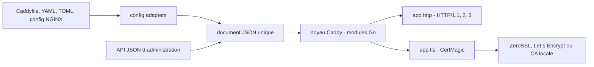

# caddyserver/caddy

> **Serveur HTTPS en Go qui obtient et renouvelle ses certificats tout seul, configurable par API.**

## Le problème

Servir un site en HTTPS demande d'ordinaire d'obtenir un certificat, de le renouveler avant
expiration et de câbler tout ça dans une configuration éparpillée entre fichier, drapeaux de
ligne de commande et variables d'environnement. Quand le renouvellement rate ou qu'OCSP
tombe, le serveur tombe avec.

## Ce que ça fait vraiment

Caddy est un serveur HTTP qui active TLS par défaut : il demande les certificats à ZeroSSL ou
Let's Encrypt pour les noms publics, et gère une autorité de certification locale pour les
noms internes et les adresses IP, avec bascule entre émetteurs si l'un échoue. Plusieurs
instances peuvent se coordonner en grappe. HTTP/1.1, HTTP/2 et HTTP/3 sont servis d'office,
ainsi que l'Encrypted ClientHello.

Sa configuration native est un unique document JSON, exposé et modifiable à chaud via une API.
Des *config adapters* convertissent d'autres formats vers ce JSON : Caddyfile, JSON 5, YAML,
TOML, configuration NGINX. Le README décrit aussi Caddy comme une plateforme d'exécution de
programmes Go : ses « apps » (`tls` et `http` sont livrées en standard) sont des modules Go,
et le système de plugins permet d'en ajouter à la compilation.

Le README se décrit lui-même avec « production-ready », « powerful » et « highly extensible » :
ce vocabulaire promotionnel est à noter, la substance vérifiable est celle listée ci-dessus.

## Comment c'est branché



Tout entre par un document de configuration unique : soit écrit directement en JSON, soit
produit par un adaptateur depuis un autre format, soit poussé à chaud par l'API. Le noyau
instancie les modules Go décrits par ce document ; l'app `http` sert le trafic, l'app `tls`
(adossée à CertMagic, cité par le README) obtient et renouvelle les certificats auprès d'une
autorité publique ou de l'autorité locale gérée par Caddy.

## Essayer

Le chemin recommandé par le README est de télécharger l'exécutable depuis les GitHub Releases
et de le placer dans le PATH. Pour compiler depuis les sources (Go 1.25.0 ou plus récent) :

```bash
$ git clone "https://github.com/caddyserver/caddy.git"
$ cd caddy/cmd/caddy/
$ go build
```

Lier un port bas peut demander une élévation de privilèges :

```bash
sudo setcap cap_net_bind_service=+ep ./caddy
```

Les tests, puis la construction avec plugins et information de version via `xcaddy` :

```bash
$ go test ./...
$ go test ./modules/caddyhttp/tracing/
$ xcaddy build
```

## Coût et pièges

Le logiciel est gratuit et sans dépendance externe (« pas même la libc » selon le README).
Les pièges sont ailleurs. L'HTTPS automatique s'appuie sur des autorités de certification
tierces (ZeroSSL, Let's Encrypt) : il faut un nom public résolvable et un accès sortant vers
elles, sinon on retombe sur la CA locale, dont les certificats ne sont pas reconnus hors du
périmètre interne. Ajouter des plugins impose de recompiler avec `xcaddy`, pas de charger un
module à chaud. Le README avertit que les étapes de compilation « for development »
n'embarquent pas l'information de version. Côté support : forum communautaire gratuit, mais
le README conseille aux entreprises un contrat de support payant via Ardan Labs, et réserve
l'aide privée aux sponsors. Le nom « Caddy » est une marque déposée de Stack Holdings GmbH.

## Ce que ce n'est pas

Ce n'est pas un simple reverse proxy à poser devant une application : c'est une plateforme
modulaire dont la configuration JSON demande d'en comprendre la structure — le README insiste
pour que tout le monde fasse le guide « Getting Started » avant. Ce n'est pas non plus un
gestionnaire de certificats autonome : cette partie est CertMagic, projet distinct. Enfin, le
README ne documente presque rien en détail et renvoie systématiquement au site
caddyserver.com ; on ne peut pas exploiter Caddy avec le seul dépôt sous les yeux.

## Alternatives

- **smallstep/certificates** : si le besoin est une autorité de certification interne et de la
  gestion de certificats, sans servir de trafic HTTP.
- **go-gost/gost** et **snail007/goproxy** : pour du proxy et du tunneling généralistes plutôt
  que pour servir des sites en HTTPS avec certificats automatiques.
- **caddyserver/xcaddy**, nommé dans le README, n'est pas une alternative mais le compagnon
  obligé dès qu'on veut des plugins.

## Pour toi

Utile dès qu'il faut exposer proprement une démo, une API d'inférence ou un tableau de bord
interne : l'HTTPS automatique et la CA locale évitent le bricolage certbot devant chaque
service. À l'inverse, si l'ingress est déjà géré par la plateforme (Kubernetes, cloud managé),
Caddy fait doublon.
