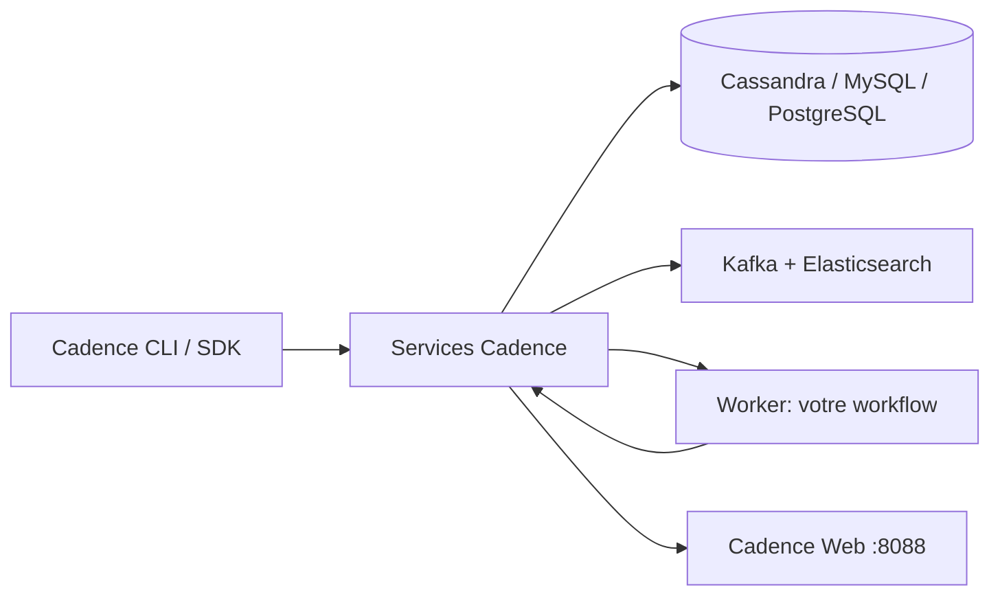

# cadence-workflow/cadence

> Moteur d'orchestration de workflows longue durée, tolérants aux pannes, ouvert depuis 2017.

## Le problème
Un traitement qui dure des heures ou des jours et doit survivre aux redémarrages ne tient pas dans
un cron : il faut persister l'état, rejouer l'historique et retenter les étapes échouées.

## Ce que ça fait vraiment
Fournit le moteur d'orchestration et son outillage : CLI, gestion de schémas, banc de charge et canary.
Le backend regroupe plusieurs services, une base (Cassandra, MySQL ou PostgreSQL) et, en option,
Kafka et Elasticsearch. L'utilisateur écrit un **worker** contenant l'implémentation du workflow, puis
déclenche les exécutions via SDK ou CLI. Une interface web sur le port 8088 affiche historiques et
traces détaillées. Déploiement Kubernetes via le chart officiel `cadence-charts`.

## Comment c'est branché


## Essayer
```bash
docker compose -f docker/docker-compose.yml up
brew install cadence-workflow
docker run --rm ubercadence/cli:master
make cadence
```

## Coût et pièges
Gratuit, mais l'infrastructure est lourde : plusieurs services, une base de données, souvent Kafka et
Elasticsearch. La mise à niveau des schémas est manuelle — le README détaille notamment qu'il faut
déplacer l'ancien schéma Elasticsearch avant `brew upgrade`, sous peine de non-mise à jour.

## Ce que ce n'est pas
Pas un ordonnanceur de tâches léger : ce n'est comparable ni à un cron ni à une simple file.
Pas un produit sans effort d'exploitation. Les SDK Python et Ruby sont **non officiels**, portés par la
communauté ; seuls Go et Java sont officiels. Aucune licence dans ce README.

## Alternatives
- **iWF** : framework DSL bâti au-dessus de Cadence, plus simple à écrire.
- **KubeStellar Console** : parcours guidé d'installation Kubernetes via `cadence-charts`.

## Pour toi
Pertinent si tes pipelines durent des jours ; sinon l'exploitation coûte plus cher que le problème.
