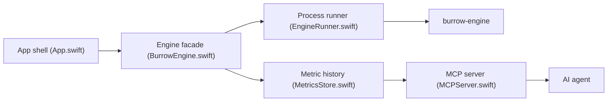

# caezium/Burrow

> App de nettoyage et de suivi d'un Mac, avec serveur MCP pour laisser un agent IA l'inspecter.

## Le problème
Nettoyer caches, artefacts de dev (`node_modules`, `target/`…), installeurs et apps résiduelles, suivre l'état de la machine, sans empiler plusieurs outils.

## Ce que ça fait vraiment
App SwiftUI (macOS 14+, aperçu Windows) qui embarque `burrow-engine`, un binaire dont les commandes reprennent celles de l'outil `mo`. Elle fait nettoyage, purge, désinstallation, maintenance, carte disque et tableau de bord live, et garde un historique SQLite des métriques. Son serveur MCP (19 outils, lecture seule par défaut) expose ces données ; les actions destructrices exigent `confirm:true` et un réglage activé.

## Comment c'est branché


## Essayer
```bash
brew install --cask caezium/tap/burrow
claude mcp add burrow -- /Applications/Burrow.app/Contents/MacOS/Burrow --mcp
```

## Coût et pièges
Gratuit. L'app envoie des statistiques d'usage anonymes désactivables (PostHog, voir TELEMETRY.md). L'élévation root passe par le dialogue macOS. La version Windows est un aperçu non signé.

## Ce que ce n'est pas
Le dépôt est MIT mais le moteur embarqué est sous licence FSL-1.1 (code source disponible, clauses commerciales). Ce n'est pas l'app officielle Mole. L'action de nettoyage est gatée, mais la suppression permanente reste irréversible.

## Alternatives
mole.fit (app de l'auteur de `mo`, 19 $), CleanMyMac, Pearcleaner, `mo` / ncdu.

## Pour toi
À surveiller : l'idée d'un serveur MCP qui donne à un agent l'état de ta machine est utile, mais c'est un outil macOS de maintenance, pas de data/IA ; relis la licence FSL du moteur avant tout usage pro.

