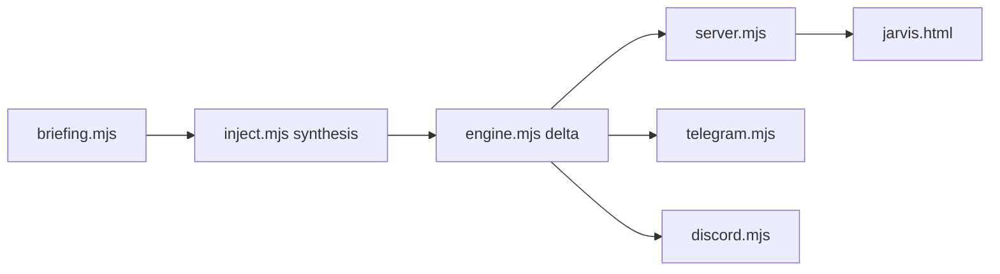

# calesthio/Crucix

> Tableau de bord local agrégeant 27 sources ouvertes (conflits, marchés, satellites) et alertant par Telegram ou Discord.

## Le problème
Les données publiques en temps réel sont éparpillées dans des dizaines d'APIs qu'on ne consulte pas une par une.

## Ce que ça fait vraiment
Toutes les 15 minutes, interroge en parallèle 27 sources (GDELT, OpenSky, NASA FIRMS, FRED, Yahoo Finance…), synthétise, calcule le delta avec le passage précédent et pousse vers le navigateur par SSE. Avec un LLM (8 fournisseurs), génère des idées et classe les alertes FLASH/PRIORITY/ROUTINE ; sans LLM, des règles prennent le relais.

## Comment c'est branché


## Essayer
```bash
git clone https://github.com/calesthio/Crucix.git
cd Crucix
npm install
cp .env.example .env
npm run dev
```

## Coût et pièges
Node 22+. 18 sources sans clé ; clés gratuites FRED, FIRMS, EIA recommandées ; ADS-B Exchange environ 10 $/mois. LLM à ta charge. AGPL-3.0.

## Ce que ce n'est pas
Ce n'est pas un conseil financier : les « idées » sont générées par LLM. Le projet n'a aucun jeton officiel malgré les avertissements du README.

## Alternatives
Non documenté : le README ne nomme pas d'alternative.

## Pour toi
Surveiller : bon exemple d'agrégation multi-sources et de détection de changements, mais jeune, à un seul mainteneur, et sous AGPL.

