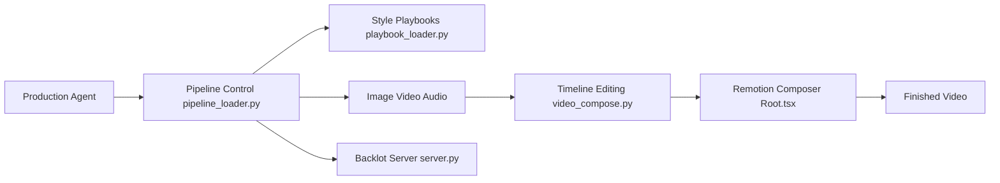

# calesthio/OpenMontage

> Pipelines de production vidéo pilotés par un assistant de code IA, du brief au rendu.

## Le problème
Produire une vidéo (script, visuels, voix, musique, montage) avec l'IA oblige à jongler entre outils et fournisseurs sans traçabilité des coûts.

## Ce que ça fait vraiment
Pas d'orchestrateur : l'assistant (Claude Code, Cursor, Codex…) lit des manifestes YAML (`pipeline_defs/`) et des skills Markdown, puis appelle des outils Python.
Étapes research → proposal → script → scene_plan → assets → edit → compose, avec validations humaines.
Rendu Remotion ou HyperFrames, post-prod FFmpeg ; TTS Piper hors ligne et stock gratuit sans clé.
Sélection de fournisseur notée sur 7 critères, plafond de budget (10 $ par défaut), tableau « Backlot » local.

## Comment c'est branché


## Essayer
```bash
git clone https://github.com/calesthio/OpenMontage.git
cd OpenMontage
make setup
python -m backlot open
make test-contracts
```

## Coût et pièges
Python 3.10+, FFmpeg, Node 18+, un assistant IA (souvent payant). Génération image/vidéo : ~0,15 à 3 $ par vidéo selon le README ; GPU pour la vidéo locale.

## Ce que ce n'est pas
Pas une appli autonome : sans assistant de code, rien ne tourne. Projet créé en mars 2026. Les garanties de qualité sont décrites par l'auteur, non vérifiées ici.

## Alternatives
Non documenté : aucun dépôt alternatif nommé.

## Pour toi
Intéressant comme exemple d'architecture « agent + skills + manifestes » ; à surveiller, pas à adopter.
