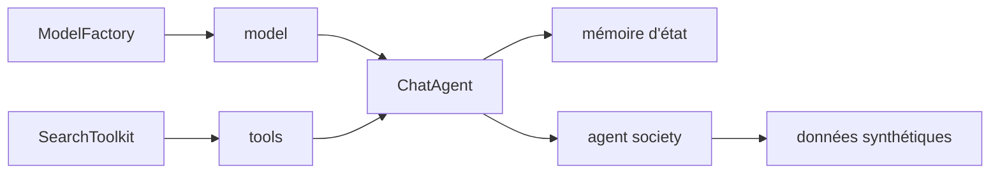

# camel-ai/camel

> Cadre multi-agents de recherche, pensé pour simuler des sociétés d'agents à grande échelle.

## Le problème
Étudier ce que font des agents qui coopèrent demande d'en faire tourner beaucoup, longtemps, avec mémoire.
Les cadres orientés production ne se prêtent pas à ce type d'expérience ni à la génération de données.

## Ce que ça fait vraiment
Quatre principes affichés : évolutivité par génération de données, passage à l'échelle, mémoire d'état, code-as-prompt.
Annonce la simulation jusqu'à un million d'agents pour étudier les comportements émergents.
Modules séparés : agents, sociétés d'agents, génération de données, modèles, outils, mémoire, stockage, benchmarks, retrievers.
Publie des jeux de données synthétiques (AI Society, Code, Math, Physics, Chemistry, Biology) sur Hugging Face.

## Comment c'est branché


## Essayer
```bash
pip install camel-ai
pip install 'camel-ai[web_tools]'
export OPENAI_API_KEY='your_openai_api_key'
```
Puis `ModelFactory.create(...)`, `ChatAgent(model=model, tools=[search_tool])`, `agent.step("What is CAMEL-AI?")`.
Journalisation optionnelle : `export CAMEL_MODEL_LOG_ENABLED=true`.

## Coût et pièges
Chaque pas d'agent est un appel modèle facturé : une simulation à grande échelle se chiffre vite.
L'exemple de démarrage suppose une clé OpenAI et le extra `web_tools` pour la recherche.

## Ce que ce n'est pas
Pas un cadre orienté production : le README se positionne comme collectif de recherche.
Pas un million d'agents chez toi : c'est une capacité de conception, pas une promesse à ton échelle de budget.
Pas une bibliothèque minimale : la surface (modules, cookbooks, benchmarks) est large à apprivoiser.

## Alternatives
`ChatDev` — projet de recherche bâti dessus, pour des agents communicants qui développent du logiciel.
`Eigent` — produit issu du même écosystème, pour une « workforce » multi-agents.

## Pour toi
À regarder si tu veux générer des données synthétiques ou étudier la coopération d'agents, pas pour livrer un produit.
