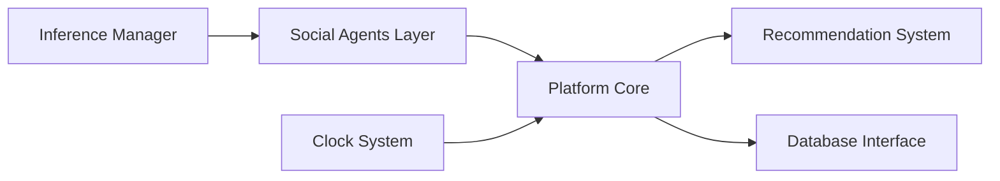

# camel-ai/oasis

> Simulateur de réseaux sociaux à base d'agents LLM, jusqu'à un million d'utilisateurs, pour chercheurs.

## Le problème
Étudier la propagation d'information, la polarisation ou l'effet de troupeau à l'échelle sans expérimenter sur de vrais utilisateurs.

## Ce que ça fait vraiment
Des agents LLM agissent sur des plateformes simulées type Twitter et Reddit : 23 types d'actions (suivre, commenter, republier…), recommandation par intérêt ou par score « hot », stockage SQLite. Un environnement `oasis.make` se pilote par pas de temps avec actions manuelles ou décidées par le LLM.

## Comment c'est branché


## Essayer
```bash
pip install camel-oasis
export OPENAI_API_KEY=<insert your OpenAI API key>
```
Puis exécuter le script Python du README avec `user_data_36.json` dans `./data/reddit`.

## Coût et pièges
Facturation par jetons : 100 agents sur un pas consomment ~335 600 jetons en entrée (mesure avec QWEN_TURBO). Le coût croît avec agents, probabilité d'activation et pas de temps.

## Ce que ce n'est pas
Ne prouve pas de comportements réels : c'est une simulation. Le passage à un million d'agents dépend de ton budget.

## Alternatives
Le README ne nomme aucune alternative.

## Pour toi
À surveiller : intéressant pour la recherche en simulation multi-agents, mais budget de jetons à mesurer avant tout grand run.
