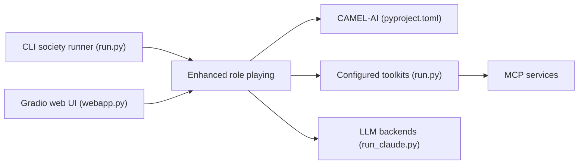

# camel-ai/owl

> Framework multi-agents sur CAMEL-AI pour automatiser des tâches réelles avec outils et navigateur.

## Le problème
Un agent seul peine sur des tâches longues qui mêlent recherche web, documents, code et navigation ; orchestrer plusieurs rôles demande beaucoup de code de liaison.

## Ce que ça fait vraiment
Construit une « société » d'agents en jeu de rôle (`construct_society`, `run_society`) qui échangent messages et appels d'outils jusqu'à une réponse.
Boîtes à outils CAMEL : recherche (Google, DuckDuckGo, Wikipedia…), navigateur Playwright, analyse image/vidéo/audio, documents, exécution de code, MCP.
Interface Gradio locale en anglais, chinois et japonais.
Score GAIA annoncé de 69,09, reproductible sur la branche `gaia69`.

## Comment c'est branché


## Essayer
```bash
git clone https://github.com/camel-ai/owl.git
cd owl
pip install uv
uv venv .venv --python=3.10
uv pip install -e .
python examples/run_mini.py
python owl/webapp.py
```

## Coût et pièges
Chaque tâche consomme des tokens chez ton fournisseur ; modèles à appel d'outils et multimodaux requis. MCP exige Node.js ; Docker possible.

## Ce que ce n'est pas
Pas un produit fini : le cœur délègue presque tout à CAMEL. Le score GAIA dépend d'une branche et d'une version CAMEL modifiées. Aucune licence déclarée.

## Alternatives
- CAMEL : le framework sous-jacent, à utiliser directement si tu n'as pas besoin de la couche OWL.

## Pour toi
À surveiller : bonne base de lecture pour les architectures multi-agents, mais l'absence de licence bloque tout usage autre qu'expérimental.
