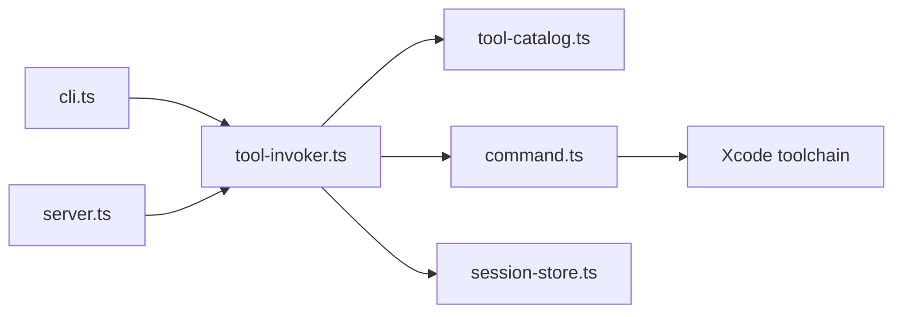

# cameroncooke/XcodeBuildMCP

> Serveur MCP et CLI qui donnent à un agent les outils pour construire des apps iOS et macOS.

## Le problème
Un agent de code ne sait pas piloter Xcode, les simulateurs et les appareils sans outils dédiés.

## Ce que ça fait vraiment
Expose via MCP et en ligne de commande la compilation, les tests, les simulateurs et appareils, l'automatisation d'UI, le débogage, la couverture, la découverte de projets et le Swift Package Manager. Un démon par espace de travail gère les opérations avec état (logs, débogage). Deux skills optionnels (MCP, CLI) se installent avec `init`. Exige macOS 14.5+ et Xcode 16+.

## Comment c'est branché


## Essayer
```bash
brew tap getsentry/xcodebuildmcp
brew install xcodebuildmcp
xcodebuildmcp --help
xcodebuildmcp tools
xcodebuildmcp simulator build --scheme MyApp --project-path ./MyApp.xcodeproj
```

## Coût et pièges
Gratuit. Sentry collecte de la télémétrie d'erreurs (désactivable, voir la page Privacy). Les outils sur appareil exigent la signature de code configurée dans Xcode.

## Ce que ce n'est pas
Pas multiplateforme : macOS et Xcode uniquement. Le schéma d'architecture le nomme « MobileBuildMCP », nom absent du README.

## Alternatives
Aucune alternative citée dans le README.

## Pour toi
À ignorer : utile seulement pour du développement iOS/macOS, sans lien avec un travail data/IA/MLOps.

