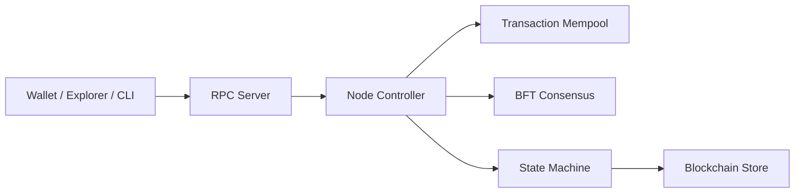

# canopy-network/canopy

> Implémentation Go d'un nœud de blockchain récursive compatible Ethereum RPC, pour développeurs de chaînes.

## Le problème
Lancer de nouvelles blockchains qui s'amorcent les unes les autres, tout en restant compatibles avec les outils Ethereum (MetaMask, explorateurs).

## Ce que ça fait vraiment
Un nœud proof-of-stake composé d'un contrôleur central, d'une machine à états (comptes, staking, gouvernance, DEX), d'un consensus BFT, d'un réseau pair-à-pair chiffré et d'un stockage indexé. Le nœud expose un serveur RPC, dont un point d'entrée `/v1/eth` traité comme RPC Ethereum personnalisé. Le dépôt contient aussi un portefeuille, un explorateur, une CLI, un signataire hors ligne et un SDK de plugins.

## Comment c'est branché


## Essayer
```bash
make build/canopy-full
canopy start
make docker/build
make docker/up-fast
make docker/logs
make test
```

## Coût et pièges
Gratuit. Le dépôt date d'octobre 2024, ce qui en fait un projet jeune, et la description d'architecture précise que les composants non échantillonnés y sont représentés de manière prudente. Toute utilisation réelle engage de l'argent : le README ne parle pas d'audit.

## Ce que ce n'est pas
Ce n'est pas un outil de données ni d'IA. Le README ne documente ni performances ni audit de sécurité.

## Alternatives
Le README ne nomme aucune alternative ; il compare seulement la compatibilité aux outils Ethereum.

## Pour toi
Ignorer : infrastructure blockchain sans lien avec data/IA/MLOps, jeune et non auditée d'après le README.

