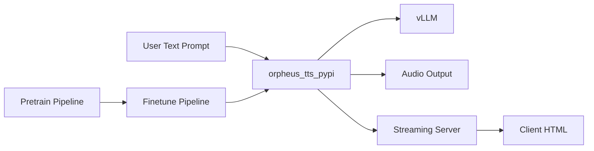

# canopyai/Orpheus-TTS

> Modèle de synthèse vocale open source basé sur Llama-3B, avec streaming et clonage de voix.

## Le problème
Les TTS open source sonnent souvent robotiques, tandis que les meilleurs rendus expressifs sont fermés.

## Ce que ça fait vraiment
Modèle 3B finetuné (voix nommées : tara, leah…) et modèle pré-entraîné sur 100k+ heures d'anglais.
Balises d'émotion, clonage zéro-shot via paires texte-audio dans le prompt, streaming ~200 ms.
Paquet `orpheus-speech` s'appuyant sur vLLM ; scripts de finetuning et de pré-entraînement façon Transformers.
Famille multilingue en release de recherche ; options sans GPU (llama.cpp) et filigrane audio.

## Comment c'est branché


## Essayer
```bash
git clone https://github.com/canopyai/Orpheus-TTS.git
cd Orpheus-TTS && pip install orpheus-speech
pip install transformers datasets wandb trl flash_attn torch
accelerate launch train.py
```

## Coût et pièges
GPU nécessaire pour vLLM ; version vLLM à épingler (0.7.3) à cause d'un bug.
Glitch connu de frames sautées en streaming ; le Colab de clonage est à corriger.

## Ce que ce n'est pas
Pas multilingue en production : les langues autres que l'anglais sont en recherche.
Pas un service hébergé gratuit (Baseten est payant).

## Alternatives
- Baseten : déploiement géré recommandé par les auteurs.

## Pour toi
À surveiller : TTS ouvert de bonne qualité et finetunable, utile pour des assistants vocaux maison, encore un peu instable.
