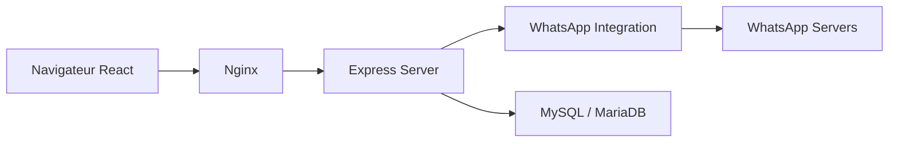

# canove/whaticket-community

> Version open source d'un système de tickets WhatsApp : plusieurs agents répondent depuis un même numéro.

## Le problème
Une équipe support qui reçoit ses clients sur WhatsApp ne peut pas partager un seul numéro entre plusieurs agents.

## Ce que ça fait vraiment
Chaque conversation devient un ticket (en attente, ouvert, résolu) assigné à un agent, avec files, réponses rapides, médias, contacts et tableau de bord. Backend Node.js/TypeScript/Express/Sequelize sur MySQL ou MariaDB, frontend React + Material UI, WebSockets. Le fournisseur WhatsApp est enfichable : `whatsapp-web.js` (Puppeteer) ou `whaileys` (WebSocket). Redis optionnel.

## Comment c'est branché


## Essayer
```bash
git clone https://github.com/canove/whaticket.git
cd whaticket
cp .env.example .env
docker-compose up -d --build
docker-compose exec backend npx sequelize db:seed:all
```

## Coût et pièges
Mots de passe et secrets JWT à changer ; identifiants par défaut `admin@whaticket.com` / `admin`. Node 14 exigé (ancien). Le README précise que les clients non officiels peuvent faire bloquer le numéro.

## Ce que ce n'est pas
Pas l'API officielle WhatsApp Cloud, réservée à l'offre payante. Le dépôt est en maintenance, dépendances datées.

## Alternatives
- Whaticket (offre commerciale) : API officielle, chatbots et autres canaux, dès 49 US$/mois.

## Pour toi
Ignorer : sans rapport avec ton métier et risque de blocage du numéro par WhatsApp.
