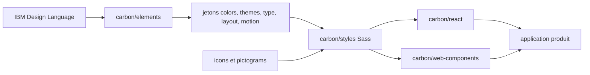

# carbon-design-system/carbon

> **IBM's open-source design system**, for front-end teams building consistent product interfaces.

## The problem

Without a shared design system, every screen reinvents its colours, spacing, typography and
components: consistency drifts and accessibility slips. Carbon supplies the common vocabulary —
tokens, grid, icons — together with the components that apply it.

## What it actually does

A monorepo publishing about a dozen npm packages. Components: `@carbon/react` (React components
and styles) and `@carbon/web-components` (standards-based web components). Foundations:
`@carbon/colors` (colour scales), `@carbon/themes` (theme tokens), `@carbon/type` (type tokens
paired with IBM Plex), `@carbon/layout` (layout units and spacing scale), `@carbon/grid`,
`@carbon/motion` (motion curves), `@carbon/icons` and `@carbon/pictograms` (with React and Vue
variants), `@carbon/styles` (Sass) and `@carbon/elements`, which bundles the IBM Design Language
foundations. Build tooling is mentioned but not detailed.

## How it is wired



Read left to right: the IBM Design Language foundations become tokens, tokens feed the Sass
stylesheets, and both component libraries — React and web components — consume those styles
inside the product application. Icons and pictograms are asset packages plugged in at the same
level. This chain is inferred from the README's package table alone; no code-derived diagram
exists for this repository.

## Trying it

```bash
# The README documents no install or start-up command.
```

The README gives neither an install line nor a code sample: it points to carbondesignsystem.com
(the Design, Develop and Migrate guides) and to the published Storybooks for React and web
components. Nothing is reconstructed here.

## Cost and traps

Free, Apache 2.0, distributed through npm, so a Node toolchain and a bundler are required. The
main trap is lock-in: adopting Carbon means adopting its tokens, its grid and IBM Plex, and
migrations happen often enough that the project maintains a dedicated migration guide. The README
says nothing about bundle size, supported React versions or the release policy.

## What it is not

It is not a generic CSS framework you repaint with your brand: it is IBM's visual language,
themeable but opinionated. Nor is it a single library — it is a monorepo of packages you compose,
and the Angular, Svelte and Vue integrations are community-maintained in separate repositories,
outside this release cycle. Finally it is not self-contained documentation: the substance lives
on the external site.

## Alternatives

No comparable alternative in the catalogue: the suggested neighbours (leonardomso/33-js-concepts,
meteor/meteor, responsively-org/responsively-app, blueedgetechno/win11React) are a JS concept
list, an application framework, a responsive testing tool and an interface demo — none is a
design system. The README does name the community ports IBM/carbon-components-angular,
IBM/carbon-components-svelte and carbon-design-system/carbon-components-vue, preferable when the
project is not on React.

## For you

Indirect interest for a data / AI / MLOps profile: this is the brick to remember the day you dress
up a dashboard or an internal tool console and want an accessible base without hiring a designer.
Worth bookmarking rather than adopting by default, since the visual commitment is heavy and the
whole manual lives outside the repository.
