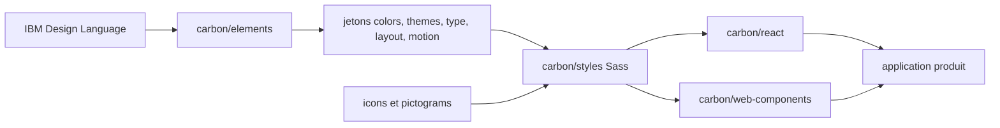

# carbon-design-system/carbon

> **Le système de design open source d'IBM**, pour les équipes front qui construisent des interfaces produit cohérentes.

## Le problème

Sans système de design partagé, chaque écran réinvente ses couleurs, ses espacements, sa
typographie et ses composants : l'incohérence s'installe et l'accessibilité se perd. Carbon
fournit le vocabulaire commun — jetons, grille, icônes — et les composants qui l'appliquent.

## Ce que ça fait vraiment

C'est un monorepo qui publie une douzaine de paquets npm. Côté composants : `@carbon/react`
(composants React et styles) et `@carbon/web-components` (composants web standards). Côté
fondations : `@carbon/colors` (échelles de couleur), `@carbon/themes` (jetons de thème),
`@carbon/type` (jetons typographiques pensés pour IBM Plex), `@carbon/layout` (unités et
échelle d'espacement), `@carbon/grid`, `@carbon/motion` (courbes d'animation), `@carbon/icons`
et `@carbon/pictograms` (avec des variantes React et Vue), `@carbon/styles` (Sass) et
`@carbon/elements`, qui regroupe les fondations de l'IBM Design Language. Le README annonce
aussi l'outillage de build, sans le détailler.

## Comment c'est branché



La lecture se fait de gauche à droite : les fondations de l'IBM Design Language deviennent des
jetons, les jetons alimentent les feuilles Sass, et les deux bibliothèques de composants — React
et web components — consomment ces styles pour être posées dans l'application. Les icônes et
pictogrammes sont des paquets d'assets branchés au même niveau. Cette chaîne est déduite du seul
tableau des paquets du README : aucun diagramme issu du code n'accompagne ce dépôt.

## Essayer

```bash
# Aucune commande d'installation ou de démarrage n'est documentée dans le README.
```

Le README ne donne ni ligne d'installation, ni extrait de code : il renvoie vers le site
carbondesignsystem.com (pages « Design », « Develop », « Migrate ») et vers les Storybook
publiés pour React et pour les web components. Rien n'est reconstruit ici.

## Coût et pièges

Gratuit, sous licence Apache 2.0, distribué par npm : il faut donc une chaîne Node et un
bundler côté projet. Le piège principal est l'adhérence — adopter Carbon, c'est adopter ses
jetons, sa grille et IBM Plex, et les migrations sont assez fréquentes pour que le projet
maintienne un guide de migration dédié. Le README ne dit rien du poids des bundles, des
versions supportées de React, ni de la politique de versions.

## Ce que ce n'est pas

Ce n'est pas un framework CSS générique que l'on habille aux couleurs de sa marque : c'est la
langue visuelle d'IBM, thémable mais orientée. Ce n'est pas non plus une bibliothèque unique —
c'est un monorepo de paquets que l'on compose, et les intégrations Angular, Svelte et Vue sont
maintenues par la communauté dans d'autres dépôts, donc hors de ce cycle de publication. Enfin,
ce n'est pas de la documentation autoportante : l'essentiel vit sur le site externe.

## Alternatives

Aucune alternative comparable dans le catalogue : les voisins proposés (leonardomso/33-js-concepts,
meteor/meteor, responsively-org/responsively-app, blueedgetechno/win11React) sont respectivement
une liste de concepts JS, un framework applicatif, un outil de test responsive et une démo
d'interface — aucun n'est un système de design. Le README nomme en revanche les portages
communautaires IBM/carbon-components-angular, IBM/carbon-components-svelte et
carbon-design-system/carbon-components-vue, à préférer si le projet n'est pas en React.

## Pour toi

Intérêt indirect pour un profil data / IA / MLOps : c'est la brique à connaître le jour où l'on
habille un dashboard ou une console d'outil interne et où l'on veut une base accessible sans
recruter un designer. À garder en signet plutôt qu'à adopter par défaut, puisque l'engagement
visuel est fort et que tout le mode d'emploi se trouve hors du dépôt.
