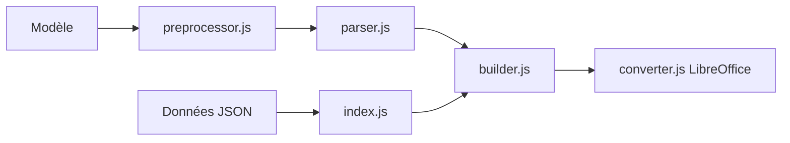

# carboneio/carbone

> Moteur Node.js de génération de rapports : JSON injecté dans des modèles Office ou LibreOffice.

## Le problème
Produire des documents (factures, rapports) à partir de données JSON sans coder la mise en page.

## Ce que ça fait vraiment
Tu écris un modèle dans LibreOffice ou Office avec des marqueurs `{d.firstname}` ; Carbone injecte le JSON et rend le document (docx, odt, xlsx, html, pptx…). Si LibreOffice est installé, il convertit en PDF via des workers gérés avec file d'attente et trois tentatives. Formats de nombres et dates, traduction, conditions. Côté serveur seulement.

## Comment c'est branché


## Essayer
```bash
npm install carbone
```
```javascript
carbone.render('./node_modules/carbone/examples/simple.odt', data, function(err, result){ });
```

## Coût et pièges
Gratuit en édition communautaire ; LibreOffice requis pour le PDF (installation manuelle sur Ubuntu). Licence présente mais non identifiée par GitHub : à vérifier, d'autant que le README mentionne plusieurs éditions.

## Ce que ce n'est pas
Pas un générateur de PDF natif. Ne tourne pas dans le navigateur.

## Alternatives
Aucune alternative nommée dans le README.

## Pour toi
À surveiller : utile pour automatiser des rapports depuis des données, mais lis la licence avant tout usage commercial.

