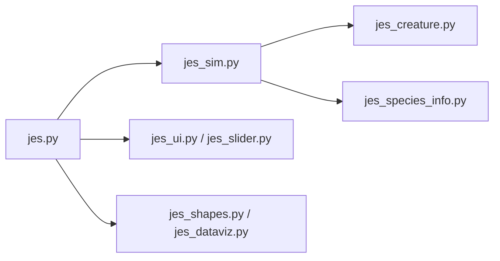

# carykh/jes

> Simulateur Python de créatures gélatineuses qui évoluent, pour regarder et explorer l'évolution génération par génération.

## Le problème
Voir l'évolution artificielle à l'œuvre demande de pouvoir remonter le temps et comparer les espèces, pas seulement le dernier état.

## Ce que ça fait vraiment
Application de bureau lancée par `jes.py` : `jes_sim.py` fait avancer les générations, `jes_creature.py` et `jes_species_info.py` portent créatures et espèces. Une frise permet de parcourir l'historique, de mettre une espèce en mémoire (S), de recolorer (C) et d'ouvrir une mosaïque des créatures (Q).

## Comment c'est branché


## Essayer
```bash
cmd python jes.py
```

## Coût et pièges
Gratuit, dépendances dans `requirements.txt`. Aucune licence : droit de réutilisation non défini.

## Ce que ce n'est pas
Pas un produit : l'auteur annonce ni correction de bugs ni support. Pas un outil de recherche en algorithmes évolutionnaires, c'est une expérience faite pour une vidéo.

## Alternatives
Aucune nommée dans le README.

## Pour toi
Ignorer : sans licence ni suivi, c'est un jouet de vulgarisation ; à regarder pour l'intuition, pas à intégrer.

