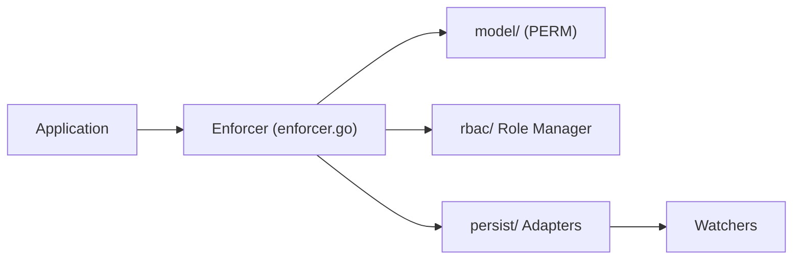

# casbin/casbin

> Bibliothèque Go de contrôle d'accès qui applique ACL, RBAC ou ABAC décrits dans un fichier de modèle.

Note : README identique à `apache/casbin` (même création, issues voisines) ; les deux entrées désignent vraisemblablement le même projet, renommé.

## Le problème
Coder soi-même les règles d'autorisation les rend rigides ; changer de modèle (ACL, RBAC, ABAC) oblige à réécrire du code.

## Ce que ça fait vraiment
Le modèle d'accès est décrit dans un fichier `.conf` selon la métamodèle PERM (Policy, Effect, Request, Matchers) ; les règles vivent dans un fichier ou une base. `Enforce(sub, obj, act)` renvoie autorisé ou refusé. La bibliothèque gère aussi les rôles hiérarchiques, un super-utilisateur, des opérateurs comme `keyMatch`, la persistance via adaptateurs et la synchronisation entre nœuds via watchers.

## Comment c'est branché


## Essayer
```bash
go get github.com/casbin/casbin/v3
```
Le README montre ensuite `casbin.NewEnforcer("path/to/model.conf", "path/to/policy.csv")` et `e.Enforce(sub, obj, act)` en Go.

## Coût et pièges
Gratuit, Apache-2.0. Avec l'opérateur `in` en ABAC, le tableau doit compter plus d'un élément, sinon panique (avertissement du README). Édition Go seulement pour cet opérateur.

## Ce que ce n'est pas
Pas d'authentification : il ne vérifie ni identifiants ni mots de passe et ne gère pas la liste des utilisateurs.

## Alternatives
Aucune alternative citée dans le README.

## Pour toi
Surveiller : intéressant si ton API de modèles est en Go et doit gérer des droits par rôle ; sans Go, ce n'est pas ton outil.

