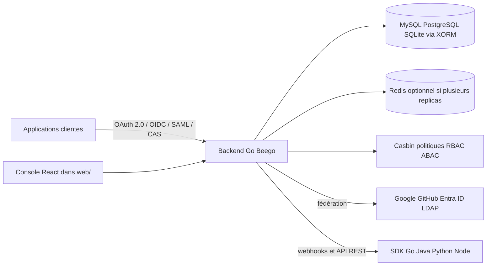

# casdoor/casdoor

> **A self-hosted identity server that owns the accounts and issues the tokens for all your applications.**

## The problem

Without it, every application re-implements its own sign-in screen, password storage and roles, and a legacy service that only speaks CAS or LDAP shares no account with a modern OIDC single-page app. You end up maintaining several user directories and keeping them in sync by hand.

## What it actually does

Casdoor stores the users, issues the tokens and ships a web admin console. The README is explicit: it is a complete identity provider, not an authentication proxy and not a library you embed. The same directory is reachable over OAuth 2.0, OIDC, SAML 2.0 (as both IdP and SP), CAS, LDAP and SCIM 2.0. Sign-in methods include password, email or SMS codes, WebAuthn/passkeys, TOTP/MFA, Face ID and social providers such as Google, GitHub and Entra ID. Multi-tenancy is done through organizations, each with its own users and branding. Authorization is expressed with Casbin (ACL, RBAC, ABAC, custom models) instead of a fixed permission scheme. Organizations, applications, providers, email and SMS templates and login-page branding are edited in the console rather than in files you redeploy. The README also lists an MCP gateway, A2A support, webhooks, a REST API covering every console action, a Swagger explorer and SDKs for Go, Java, Python, Node.js, .NET, PHP and Rust.

## How it is wired



A frontend/backend separated application, as the "Technology stack" section describes it: a Go backend on Beego exposing REST APIs, a React 18 console with shadcn/ui on Tailwind built by Vite under `web/` (the previous Ant Design console stays in `web-old/` and is no longer built or served), a relational database through XORM, and optional Redis, needed only when running more than one Casdoor replica. Server settings live in `conf/app.conf` (`driverName`, `dataSourceName`, `dbName`, `origin`, `runmode`), and `conf/conf.go` rewrites `localhost` to the Docker host address when `RUNNING_IN_DOCKER=true`.

## Trying it

```bash
docker run -p 8000:8000 casbin/casdoor-all-in-one
```

Then open <http://localhost:8000> with organization `built-in`, username `admin`, password `123` — the README stresses these are two separate fields, not a username containing a slash. The other documented paths:

```bash
docker compose up
```

```bash
helm install casdoor oci://registry-1.docker.io/casbin/casdoor-helm-charts
kubectl get svc
kubectl port-forward svc/<service-name-from-above> 8000:8000
```

```bash
git clone https://github.com/casdoor/casdoor.git
cd casdoor
cd web && yarn install && yarn build && cd .. && go run main.go
```

## Cost and traps

The software is free under Apache 2.0; paid commercial support exists separately. The all-in-one image is explicitly marked as not intended for production: its data lives inside the container and disappears with it. The Docker Compose path builds the image from source (Go plus React), so the first `docker compose up` takes several minutes, and `conf/app.conf` must point at the bundled MySQL first. The Helm chart exposes nothing outside the cluster by default: a real deployment needs an Ingress and an external database. From source you need Go 1.25+, Node.js 20 LTS, Yarn 1.x and a supported database. Before exposing an instance to the internet the README requires changing the `123` password, serving over HTTPS only, setting `origin`, reviewing `conf/app.conf` (especially `dataSourceName` and provider secrets), and setting `runmode = prod` with `showSql = false`. Social, email, SMS or payment features imply accounts with third-party providers, and the full documentation lives on casdoor.ai rather than in the repository.

## What it is not

It is not an authentication proxy to drop in front of an existing reverse proxy — the README itself says a smaller tool may suit you better if all you need is a login screen there. It is not a library you integrate either: it is a server that owns the directory, with its own database and operational lifecycle. The hosted demos are not a working environment: `demo.casdoor.com` resets its data about every 5 minutes and `door.casdoor.net` fails every write by design. And the one-command install does not give you a finished system: after signing in you still have to change the password, create an application, connect a provider and pick an SDK.

## Alternatives

- **langgenius/dify**, **Mintplex-Labs/anything-llm**, **mudler/LocalAI** and **HKUDS/nanobot** are LLM tooling and do no identity management: there is no comparable alternative in the catalogue for this repository.
- The README names no competitor; it only cites Casbin as the built-in policy engine, plus Beego, XORM and shadcn/ui as components, not as substitutes.

## For you

If you are building a multi-team data/ML platform, this is the piece that lets you keep a single directory for the internal console, notebooks behind SAML and the legacy LDAP service, with Casbin roles instead of a home-made scheme. The announced MCP gateway is worth watching if you start exposing MCP servers to agents and need access control over them — but you take on operating a critical service, database and secrets included.
