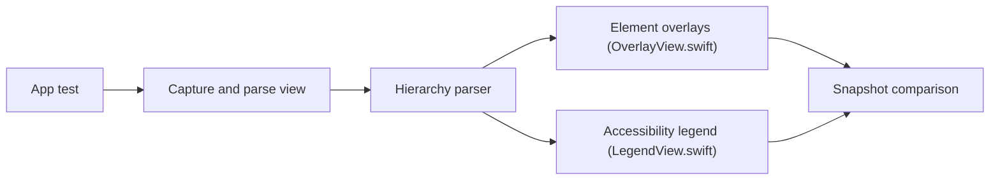

# cashapp/AccessibilitySnapshot

> Bibliothèque de tests de régression d'accessibilité pour applications iOS, par snapshots de la hiérarchie d'accessibilité.

## Le problème
Une modification d'interface peut casser l'accessibilité sans que personne le voie.

## Ce que ça fait vraiment
Capture une vue, analyse sa hiérarchie d'accessibilité et produit une image annotée (marqueurs, légende, points d'activation) comparée à une référence. S'appuie sur SnapshotTesting par défaut, ou iOSSnapshotTestCase. Prend aussi en charge claviers et zones de touche.

## Comment c'est branché


## Essayer
```bash
# Package.swift : .package(name: "AccessibilitySnapshot", url: "https://github.com/cashapp/AccessibilitySnapshot.git", from: "0.4.1")
# Test : assertSnapshot(matching: view, as: .accessibilityImage)
```

## Coût et pièges
Gratuit. Xcode 13.2.1+, iOS 13+, cible de test avec application hôte.

## Ce que ce n'est pas
Pas un audit automatique : il compare des images à une référence enregistrée et ne juge pas la conformité.

## Alternatives
Basé sur SnapshotTesting ou iOSSnapshotTestCase ; extension PlaybookAccessibilitySnapshot pour Playbook.

## Pour toi
À ignorer : test d'applications iOS, sans lien avec data, IA ou MLOps.

