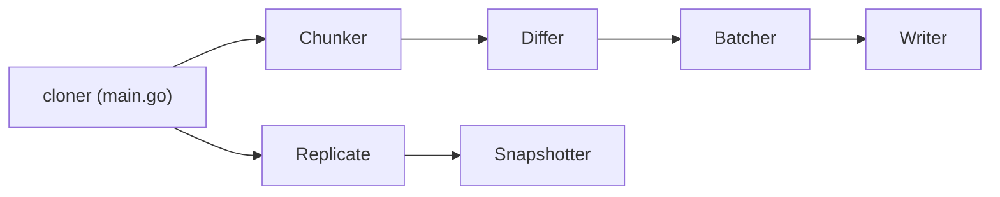

# cashapp/cloner

> Application Go qui clone et réplique une base MySQL vers une autre sans arrêter les écritures.

## Le problème
Copier ou vérifier une grande base MySQL vivante sans figer la réplication est lent et risque de perdre la cohérence.

## Ce que ça fait vraiment
Découpe les tables en morceaux, compare source et cible, regroupe les écarts (insert, update, delete) et les écrit en parallèle. Il lit aussi le binlog MySQL pour répliquer avec des points de reprise, vérifie les sommes de contrôle par morceau, mesure le retard de bout en bout (métrique Prometheus) et propose un clonage cohérent suivant l'algorithme DBLog de Netflix. Le DDL n'est pas géré pendant la réplication.

## Comment c'est branché


## Essayer
```bash
# Aucune commande documentée dans le README : voir le tutoriel du dépôt.
```

## Coût et pièges
Le clonage cohérent exige un accès en écriture à la source (table de filigranes). Dernier push en mars 2024 : peu de suivi. MySQL uniquement.

## Ce que ce n'est pas
Pas un outil de migration de schéma : pas de DDL en réplication. Ne convient pas à PostgreSQL ou aux bases non MySQL.

## Alternatives
Aucune alternative nommée dans le README ; il cite l'article DBLog (Netflix) comme algorithme.

## Pour toi
Surveiller : utile si tu dois copier des bases MySQL vivantes vers un lac ou un entrepôt, mais inactif depuis 2024 ; à tester avant de s'y fier.
